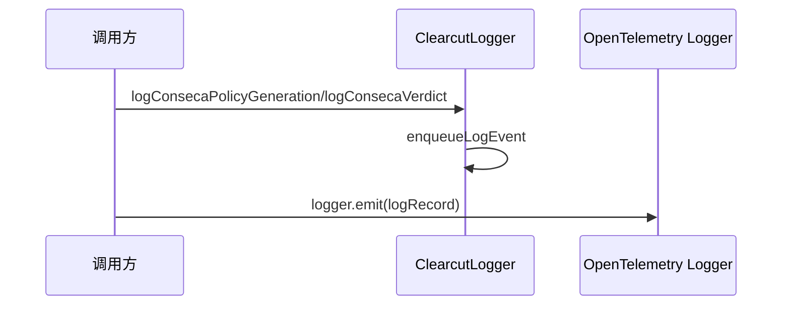

# conseca-logger.ts

> Conseca 安全策略生成和裁决事件的遥测日志记录

## 概述
该文件为 Conseca（内容安全策略引擎）提供两个核心遥测日志函数：策略生成事件和裁决事件。每个函数同时向 ClearcutLogger（Google 内部日志）和 OpenTelemetry 日志系统发送事件。

## 架构图

## 主要导出

### `function logConsecaPolicyGeneration(config: Config, event: ConsecaPolicyGenerationEvent): void`
记录 Conseca 策略生成事件，包含用户提示、受信内容、生成的策略以及可能的错误信息。

### `function logConsecaVerdict(config: Config, event: ConsecaVerdictEvent): void`
记录 Conseca 裁决事件，包含用户提示、策略、工具调用、裁决结果、裁决理由和可能的错误。

## 核心逻辑
1. 先通过 `ClearcutLogger` 发送结构化事件数据（使用 `EventMetadataKey` 枚举键）。
2. 检查 OpenTelemetry SDK 是否已初始化（`isTelemetrySdkInitialized()`），若已初始化则通过 OTel 日志器发送。

## 内部依赖
- `./clearcut-logger/clearcut-logger.js` — `ClearcutLogger`, `EventNames`
- `./clearcut-logger/event-metadata-key.js` — `EventMetadataKey`
- `./constants.js` — `SERVICE_NAME`
- `./sdk.js` — `isTelemetrySdkInitialized`
- `./types.js` — `ConsecaPolicyGenerationEvent`, `ConsecaVerdictEvent`
- `../utils/safeJsonStringify.js`
- `../utils/debugLogger.js`

## 外部依赖
- `@opentelemetry/api-logs` — `logs`, `LogRecord`
