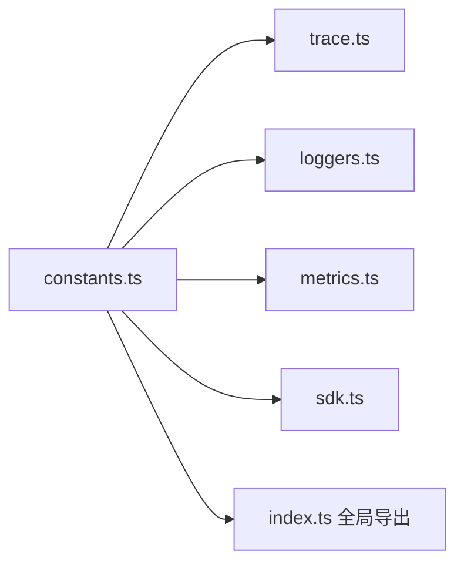

# constants.ts

> 定义遥测模块的常量：服务名称、GenAI 语义约定属性键和操作枚举

## 概述
该文件集中定义了遥测模块中使用的所有常量，包括服务标识信息、符合 OpenTelemetry GenAI 语义约定的属性键名，以及 Gemini CLI 特有的操作类型枚举。这些常量被 trace、loggers、metrics 等多个模块引用。

## 架构图

## 主要导出

### 服务标识
- `SERVICE_NAME = 'gemini-cli'`
- `SERVICE_DESCRIPTION` — Gemini CLI 简要描述

### GenAI 语义约定属性键
遵循 [OpenTelemetry GenAI 语义约定](https://opentelemetry.io/docs/specs/semconv/registry/attributes/gen-ai/)：
- `GEN_AI_OPERATION_NAME`, `GEN_AI_AGENT_NAME`, `GEN_AI_AGENT_DESCRIPTION`
- `GEN_AI_INPUT_MESSAGES`, `GEN_AI_OUTPUT_MESSAGES`
- `GEN_AI_REQUEST_MODEL`, `GEN_AI_RESPONSE_MODEL`, `GEN_AI_PROMPT_NAME`
- `GEN_AI_TOOL_NAME`, `GEN_AI_TOOL_CALL_ID`, `GEN_AI_TOOL_DESCRIPTION`
- `GEN_AI_USAGE_INPUT_TOKENS`, `GEN_AI_USAGE_OUTPUT_TOKENS`
- `GEN_AI_SYSTEM_INSTRUCTIONS`, `GEN_AI_TOOL_DEFINITIONS`
- `GEN_AI_CONVERSATION_ID`

### `enum GeminiCliOperation`
Gemini CLI 特有的操作类型：`ToolCall`、`LLMCall`、`UserPrompt`、`SystemPrompt`、`AgentCall`、`ScheduleToolCalls`。

## 核心逻辑
纯常量定义文件，无运行时逻辑。

## 内部依赖
无

## 外部依赖
无
