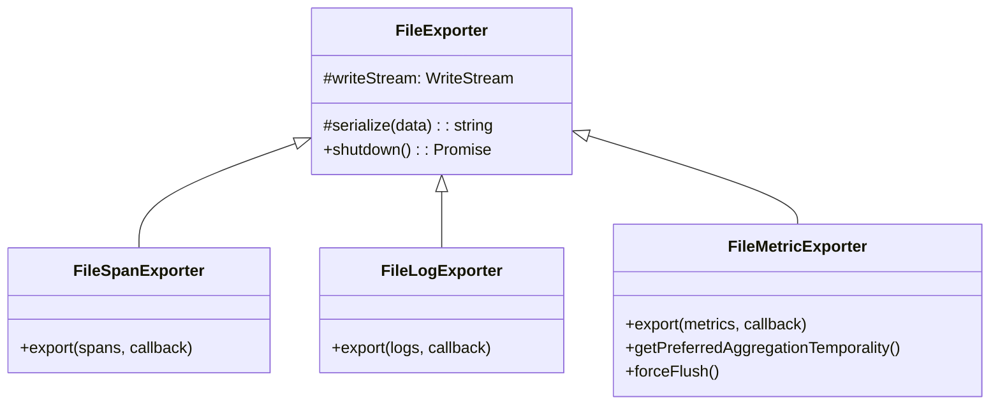

# file-exporters.ts

> 将 OpenTelemetry 的 Span、Log、Metric 数据以 JSON 格式追加写入本地文件

## 概述
该文件实现了三个基于文件的 OpenTelemetry 导出器，用于本地遥测开发和调试场景。所有导出器继承自 `FileExporter` 基类，通过 Node.js 的 `WriteStream` 以追加模式将序列化后的 JSON 数据写入指定文件路径。

## 架构图

## 主要导出

### `class FileSpanExporter` (implements `SpanExporter`)
将 `ReadableSpan[]` 序列化为 JSON 并写入文件。

### `class FileLogExporter` (implements `LogRecordExporter`)
将 `ReadableLogRecord[]` 序列化为 JSON 并写入文件。

### `class FileMetricExporter` (implements `PushMetricExporter`)
将 `ResourceMetrics` 序列化为 JSON 并写入文件。聚合时间性为 `CUMULATIVE`。

## 核心逻辑
- `FileExporter` 基类在构造时以追加模式（`flags: 'a'`）创建 `WriteStream`。
- `serialize()` 使用 `safeJsonStringify` 格式化输出，带 2 空格缩进。
- 导出回调中根据写入是否出错返回 `SUCCESS` 或 `FAILED`。

## 内部依赖
- `../utils/safeJsonStringify.js` — `safeJsonStringify`

## 外部依赖
- `node:fs` — `WriteStream`
- `@opentelemetry/core` — `ExportResultCode`, `ExportResult`
- `@opentelemetry/sdk-trace-base` — `ReadableSpan`, `SpanExporter`
- `@opentelemetry/sdk-logs` — `ReadableLogRecord`, `LogRecordExporter`
- `@opentelemetry/sdk-metrics` — `AggregationTemporality`, `ResourceMetrics`, `PushMetricExporter`
