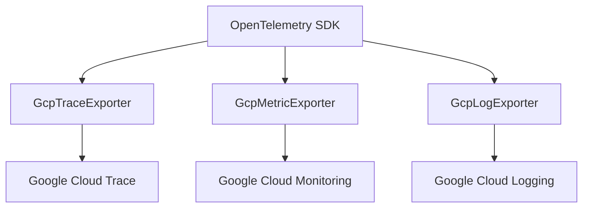

# gcp-exporters.ts

> Google Cloud Platform 原生遥测导出器（Trace、Metric、Log）

## 概述
该文件实现了三个 GCP 原生导出器，用于将遥测数据直接发送到 Google Cloud 的 Trace、Monitoring 和 Logging 服务。在 `telemetryTarget` 为 `gcp` 且不使用 collector 代理的场景下，SDK 初始化时会选择这些导出器。

## 架构图

## 主要导出

### `class GcpTraceExporter` (extends `TraceExporter`)
继承自 `@google-cloud/opentelemetry-cloud-trace-exporter`，使用 `resourceFilter: /^gcp\./` 过滤非 GCP 资源属性。

### `class GcpMetricExporter` (extends `MetricExporter`)
继承自 `@google-cloud/opentelemetry-cloud-monitoring-exporter`，指标前缀为 `custom.googleapis.com/gemini_cli`。

### `class GcpLogExporter` (implements `LogRecordExporter`)
自行实现的日志导出器，使用 `@google-cloud/logging` 客户端。
- **export(logs, resultCallback)**: 将 OTel 日志记录转换为 Cloud Logging 条目并批量写入。
- **forceFlush()**: 等待所有挂起的写入完成。
- **shutdown()**: 刷新并清理。
- 内部方法 `mapSeverityToCloudLogging` 将 OTel 严重级别数字映射到 Cloud Logging 级别字符串。

## 核心逻辑
- Trace 和 Metric 导出器通过继承官方 SDK 类实现，仅覆盖构造参数。
- Log 导出器需要手动实现，因为 Google Cloud 没有官方的 OTel 日志导出器。使用 `pendingWrites` 数组追踪异步写入操作以支持 `forceFlush()`。

## 内部依赖
无

## 外部依赖
- `google-auth-library` — `JWTInput`
- `@google-cloud/opentelemetry-cloud-trace-exporter` — `TraceExporter`
- `@google-cloud/opentelemetry-cloud-monitoring-exporter` — `MetricExporter`
- `@google-cloud/logging` — `Logging`, `Log`
- `@opentelemetry/core` — `hrTimeToMilliseconds`, `ExportResultCode`
- `@opentelemetry/sdk-logs` — `ReadableLogRecord`, `LogRecordExporter`
