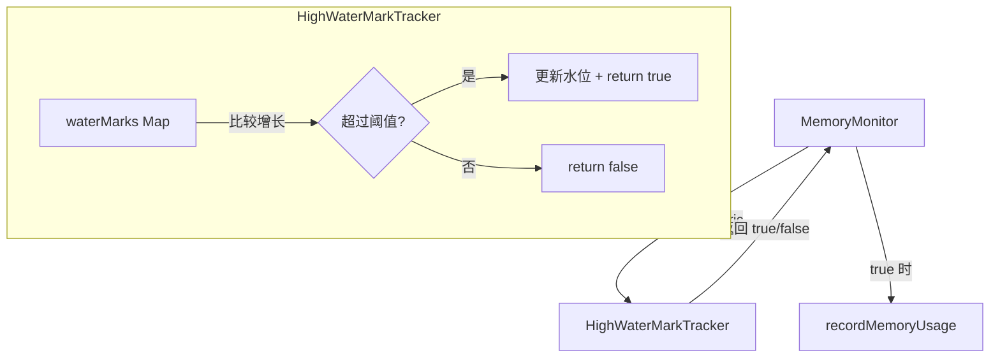

# high-water-mark-tracker.ts

> 内存指标高水位追踪器，仅在内存使用量显著增长时触发记录

## 概述
`HighWaterMarkTracker` 用于追踪各类内存指标的历史最高值（高水位标记）。只有当某个指标超过当前高水位一定百分比阈值时，才认为该指标值"值得记录"。这种机制避免了在内存使用平稳时频繁发送遥测数据，有效降低噪声。

## 架构图

## 主要导出

### `class HighWaterMarkTracker`
- **constructor(growthThresholdPercent?: number)**: 默认增长阈值 5%。
- **shouldRecordMetric(metricType: string, currentValue: number): boolean**: 判断当前值是否应触发记录。首次测量必定返回 true。
- **getHighWaterMark(metricType: string): number**: 获取指定指标的当前高水位。
- **getAllHighWaterMarks(): Record<string, number>**: 获取所有高水位。
- **resetHighWaterMark(metricType: string)**: 重置指定指标的高水位。
- **resetAllHighWaterMarks()**: 重置所有高水位。
- **cleanup(maxAgeMs?: number)**: 清理超过指定时间未更新的陈旧条目，默认 1 小时。

## 核心逻辑
1. 维护两个 Map：`waterMarks`（各指标的高水位）和 `lastUpdateTimes`（最后更新时间）。
2. `shouldRecordMetric` 比较 `currentValue > currentWaterMark * (1 + threshold/100)`，超过则更新水位并返回 true。
3. `cleanup` 方法删除超过 `maxAgeMs` 未更新的条目，防止无界增长。

## 内部依赖
无

## 外部依赖
无
