# index.ts

> 遥测模块的统一入口文件，聚合并重新导出所有遥测子模块的公共 API

## 概述
该文件是 `telemetry` 模块的桶文件（barrel file），负责从各子模块中选择性地重新导出类、函数、类型和枚举，形成一个统一的公共 API 表面。外部模块通过 `import { ... } from './telemetry/index.js'` 即可访问所有遥测功能。该文件还定义了 `TelemetryTarget` 枚举和默认配置常量。

## 架构图

```mermaid
graph TD
    A[index.ts] -->|re-export| B[sdk.ts]
    A -->|re-export| C[config.ts]
    A -->|re-export| D[gcp-exporters.ts]
    A -->|re-export| E[loggers.ts]
    A -->|re-export| F[conseca-logger.ts]
    A -->|re-export| G[types.ts]
    A -->|re-export| H[metrics.ts]
    A -->|re-export| I[memory-monitor.ts]
    A -->|re-export| J[activity-detector.ts]
    A -->|re-export| K[activity-monitor.ts]
    A -->|re-export| L[trace.ts]
    A -->|re-export| M[startupProfiler.ts]
    A -->|re-export| N[constants.ts]
    A -->|re-export| O[uiTelemetry.ts]
    A -->|re-export| P[billingEvents.ts]
    A -->|re-export| Q[其他子模块]
```

## 主要导出

### 本地定义
- `enum TelemetryTarget { GCP = 'gcp', LOCAL = 'local' }`
- `DEFAULT_TELEMETRY_TARGET = TelemetryTarget.LOCAL`
- `DEFAULT_OTLP_ENDPOINT = 'http://localhost:4317'`

### 重新导出汇总
- **SDK 生命周期**: `initializeTelemetry`, `shutdownTelemetry`, `flushTelemetry`, `isTelemetrySdkInitialized`
- **配置解析**: `resolveTelemetrySettings`, `parseBooleanEnvFlag`, `parseTelemetryTargetValue`
- **GCP 导出器**: `GcpTraceExporter`, `GcpMetricExporter`, `GcpLogExporter`
- **日志函数**: `logCliConfiguration`, `logUserPrompt`, `logToolCall`, `logApiRequest` 等 20+ 函数
- **事件类型**: `StartSessionEvent`, `UserPromptEvent`, `ToolCallEvent`, `ApiResponseEvent` 等 30+ 类/接口
- **指标函数**: `recordToolCallMetrics`, `recordTokenUsageMetrics`, `recordMemoryUsage` 等 30+ 函数
- **内存监控**: `MemoryMonitor`, `initializeMemoryMonitor`, `startGlobalMemoryMonitoring` 等
- **活动监控**: `ActivityDetector`, `ActivityMonitor`, `ActivityType` 等
- **追踪**: `runInDevTraceSpan`, `SpanMetadata`
- **启动分析**: `startupProfiler`, `StartupProfiler`
- **OTel 再导出**: `SpanStatusCode`, `ValueType`, `SemanticAttributes`

## 核心逻辑
纯重新导出文件，无运行时逻辑。

## 内部依赖
所有 telemetry 子模块。

## 外部依赖
- `@opentelemetry/api` — `SpanStatusCode`, `ValueType`
- `@opentelemetry/semantic-conventions` — `SemanticAttributes`
