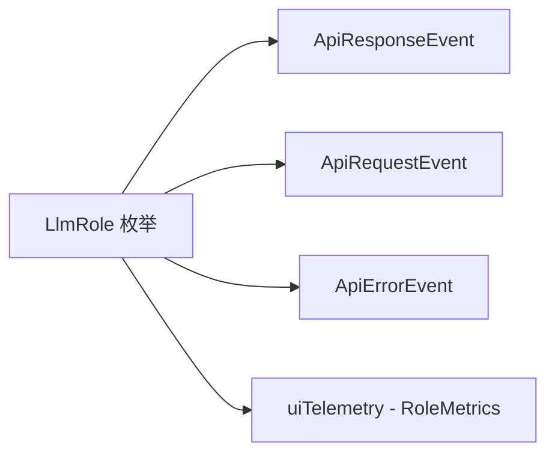

# llmRole.ts

> 定义 LLM 角色枚举，用于区分不同用途的 LLM 调用

## 概述
该文件定义了 `LlmRole` 枚举，用于在遥测中标记每次 LLM 调用的角色（用途）。这使得在分析遥测数据时能区分主对话模型、子代理、工具辅助、压缩器、路由器等不同场景的 API 调用，便于按角色维度进行 token 用量和延迟分析。

## 架构图

## 主要导出

### `enum LlmRole`
| 值 | 含义 |
|---|---|
| `MAIN` | 主对话模型 |
| `SUBAGENT` | 子代理 |
| `UTILITY_TOOL` | 工具辅助 LLM |
| `UTILITY_COMPRESSOR` | 上下文压缩 |
| `UTILITY_SUMMARIZER` | 摘要生成 |
| `UTILITY_ROUTER` | 模型路由 |
| `UTILITY_LOOP_DETECTOR` | 循环检测 |
| `UTILITY_NEXT_SPEAKER` | 下一个发言者判断 |
| `UTILITY_EDIT_CORRECTOR` | 编辑纠错 |
| `UTILITY_AUTOCOMPLETE` | 自动补全 |
| `UTILITY_FAST_ACK_HELPER` | 快速确认助手 |

## 核心逻辑
纯类型定义文件，无运行时逻辑。

## 内部依赖
无

## 外部依赖
无
