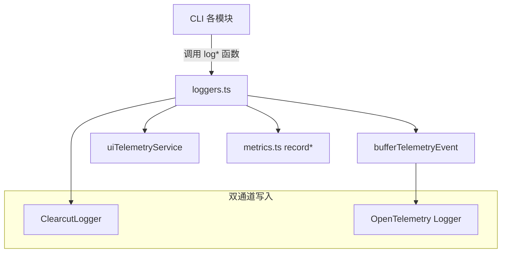

# loggers.ts

> 遥测日志记录函数的核心集合，将各类事件同时发送到 Clearcut 和 OpenTelemetry

## 概述
该文件是遥测日志系统的核心调度层，包含约 40 个日志记录函数。每个函数遵循统一模式：(1) 向 ClearcutLogger 发送事件；(2) 通过 `bufferTelemetryEvent` 向 OpenTelemetry 日志器发送事件；(3) 必要时调用 metrics 模块记录指标。部分函数还会向 `uiTelemetryService` 发送事件，用于 UI 层的实时统计展示。该文件是连接事件定义（types.ts）和实际发送（sdk.ts / clearcut-logger）的桥梁。

## 架构图

## 主要导出

### 会话和配置
- `logCliConfiguration(config, event: StartSessionEvent)`: 记录 CLI 配置（等待实验加载后再发送）。
- `logStartupStats(config, event: StartupStatsEvent)`: 记录启动统计。

### 用户交互
- `logUserPrompt(config, event)`: 记录用户提示。
- `logSlashCommand(config, event)`: 记录斜杠命令。
- `logRewind(config, event)`: 记录回退操作。

### 工具调用
- `logToolCall(config, event)`: 记录工具调用，同时记录行变更指标。
- `logToolOutputTruncated(config, event)`: 工具输出截断。
- `logToolOutputMasking(config, event)`: 工具输出遮罩。
- `logFileOperation(config, event)`: 文件操作。

### API 交互
- `logApiRequest(config, event)`: API 请求（含语义日志记录）。
- `logApiResponse(config, event)`: API 响应（含 token 用量和延迟指标）。
- `logApiError(config, event)`: API 错误（含错误指标）。

### 模型路由
- `logModelRouting(config, event)`: 模型路由决策。
- `logModelSlashCommand(config, event)`: /model 命令。
- `logFlashFallback(config, event)`: Flash 模型回退。

### 扩展管理
- `logExtensionInstallEvent`, `logExtensionUninstall`, `logExtensionUpdateEvent`, `logExtensionEnable`, `logExtensionDisable`

### Agent 生命周期
- `logAgentStart`, `logAgentFinish`, `logRecoveryAttempt`

### 错误和重试
- `logLoopDetected`, `logMalformedJsonResponse`, `logInvalidChunk`, `logNetworkRetryAttempt`, `logContentRetry`, `logContentRetryFailure`

### 计费
- `logBillingEvent(config, event: BillingTelemetryEvent)`: 统一计费事件记录。

### 其他
- `logChatCompression`, `logConversationFinishedEvent`, `logIdeConnection`, `logHookCall`, `logApprovalModeSwitch`, `logApprovalModeDuration`, `logPlanExecution`, `logLlmLoopCheck`, `logWebFetchFallbackAttempt`, `logKeychainAvailability`, `logTokenStorageInitialization`

## 核心逻辑
所有函数遵循三步模式：
1. **Clearcut**: `ClearcutLogger.getInstance(config)?.logXxxEvent(event)`
2. **OTel Buffer**: `bufferTelemetryEvent(() => { logger.emit(logRecord); })`
3. **Metrics**: 在回调中调用 `recordXxxMetrics()`（部分函数）

`bufferTelemetryEvent` 保证在 SDK 初始化前的事件不会丢失，而是被缓冲待 SDK 就绪后回放。

## 内部依赖
- `./types.js` — 所有事件类型
- `./metrics.js` — 指标记录函数
- `./sdk.js` — `bufferTelemetryEvent`
- `./uiTelemetry.js` — `uiTelemetryService`
- `./clearcut-logger/clearcut-logger.js` — `ClearcutLogger`
- `./constants.js` — `SERVICE_NAME`
- `./billingEvents.js` — 计费事件类

## 外部依赖
- `@opentelemetry/api-logs` — `logs`, `LogRecord`
