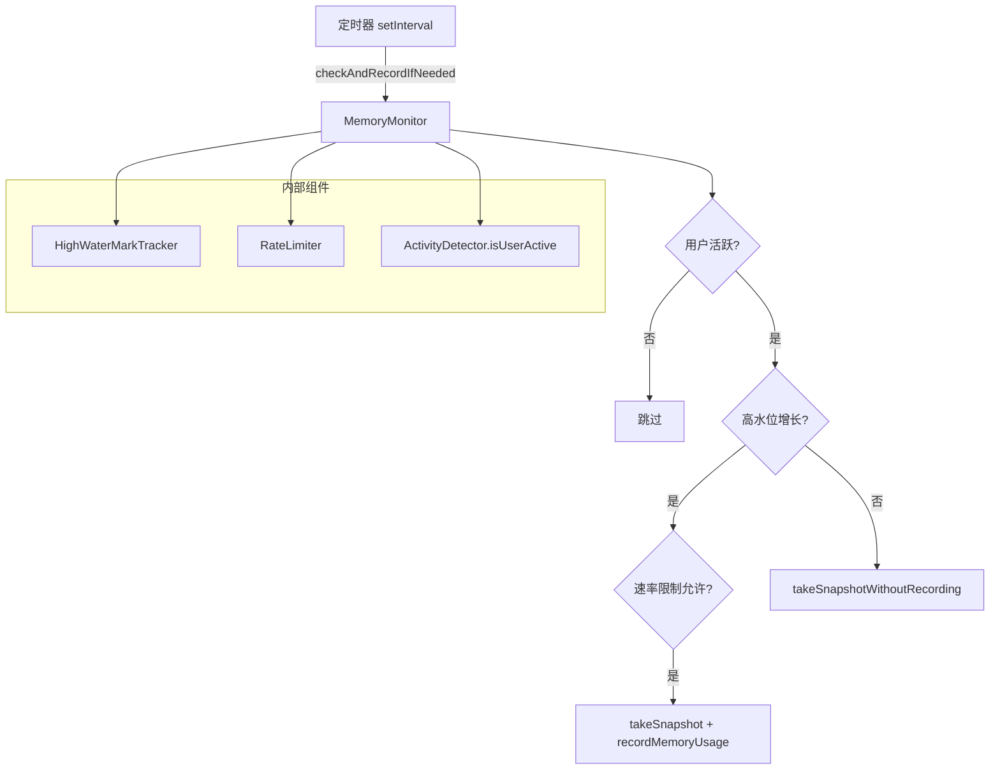

# memory-monitor.ts

> 内存监控器，定期采集进程内存指标并通过 OpenTelemetry 记录

## 概述
`MemoryMonitor` 负责持续监控 Node.js 进程的内存使用情况（堆、RSS、外部内存等），并将数据通过 OpenTelemetry 指标系统记录。它集成了高水位追踪器（`HighWaterMarkTracker`）和速率限制器（`RateLimiter`），仅在内存使用显著增长且用户处于活跃状态时才记录指标，从而减少遥测噪声和开销。

## 架构图

## 主要导出

### `interface MemorySnapshot`
内存快照数据结构：`timestamp`, `heapUsed`, `heapTotal`, `external`, `rss`, `arrayBuffers`, `heapSizeLimit`。

### `interface ProcessMetrics`
进程指标：`cpuUsage`, `memoryUsage`, `uptime`。

### `class MemoryMonitor`
- **start(config, intervalMs?)**: 启动定期监控（默认 10 秒间隔）。
- **stop(config?)**: 停止监控，可选地拍摄最终快照。
- **takeSnapshot(context, config)**: 拍摄快照并记录所有 4 种内存指标（heap_used, heap_total, external, rss）。
- **getCurrentMemoryUsage()**: 获取当前内存使用（不记录指标）。
- **getMemoryGrowth()**: 计算与上次快照的内存增长。
- **checkMemoryThreshold(thresholdMB)**: 检查堆内存是否超过阈值。
- **getMemoryUsageSummary()**: 获取以 MB 为单位的内存摘要。
- **forceRecordMemory(config, context?)**: 绕过速率限制强制记录。
- **destroy()**: 清理所有资源。

### 全局函数
- `initializeMemoryMonitor()`: 创建/获取全局单例。
- `getMemoryMonitor()`: 获取全局实例。
- `recordCurrentMemoryUsage(config, context)`: 记录当前内存。
- `startGlobalMemoryMonitoring(config, intervalMs?)`: 启动全局监控。
- `stopGlobalMemoryMonitoring(config?)`: 停止全局监控。

## 核心逻辑
增强监控模式下的 `checkAndRecordIfNeeded` 逻辑：
1. 每 15 分钟执行一次 `performPeriodicCleanup` 清理陈旧追踪状态。
2. 检查用户是否活跃（`isUserActive()`），不活跃则跳过。
3. 检查 RSS 和堆内存是否触发高水位标记。
4. 若触发高水位且速率允许 -> 记录快照。
5. 否则若速率允许定期记录 -> 仅更新内部追踪不发送指标。

## 内部依赖
- `./activity-detector.js` — `isUserActive`
- `./high-water-mark-tracker.js` — `HighWaterMarkTracker`
- `./metrics.js` — `recordMemoryUsage`, `MemoryMetricType`, `isPerformanceMonitoringActive`
- `./rate-limiter.js` — `RateLimiter`
- `../config/config.js` — `Config`
- `../utils/formatters.js` — `bytesToMB`

## 外部依赖
- `node:v8` — `getHeapStatistics`, `getHeapSpaceStatistics`
- `node:process` — `memoryUsage`, `cpuUsage`, `uptime`
