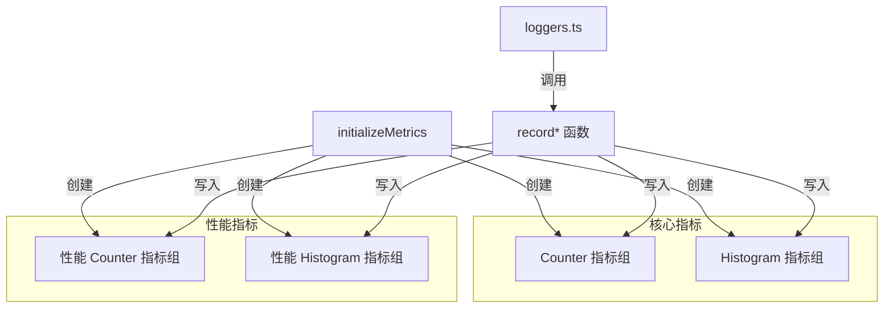

# metrics.ts

> OpenTelemetry 指标定义与记录函数的核心文件（Counter 和 Histogram）

## 概述
该文件是遥测指标系统的核心，定义了 ~50 个 OpenTelemetry 指标（Counter 和 Histogram），涵盖工具调用、API 请求、token 用量、会话计数、文件操作、Agent 运行、性能监控（启动时间、内存、CPU）、UI 渲染、计费等维度。文件同时提供了对应的 `record*` 函数用于在各业务场景中记录指标值。指标分为"核心指标"（始终启用）和"性能监控指标"（仅在遥测启用时创建）。

## 架构图

## 主要导出

### 枚举类型
- `FileOperation`: `CREATE`, `READ`, `UPDATE`
- `PerformanceMetricType`: `STARTUP`, `MEMORY`, `CPU`, `TOOL_EXECUTION`, `API_REQUEST`, `TOKEN_EFFICIENCY`
- `MemoryMetricType`: `HEAP_USED`, `HEAP_TOTAL`, `EXTERNAL`, `RSS`
- `ToolExecutionPhase`: `VALIDATION`, `PREPARATION`, `EXECUTION`, `RESULT_PROCESSING`
- `ApiRequestPhase`: `REQUEST_PREPARATION`, `NETWORK_LATENCY`, `RESPONSE_PROCESSING`, `TOKEN_PROCESSING`
- `GenAiOperationName`: `GENERATE_CONTENT`
- `GenAiProviderName`: `GCP_GEN_AI`, `GCP_VERTEX_AI`
- `GenAiTokenType`: `INPUT`, `OUTPUT`

### 核心函数
- `initializeMetrics(config)`: 创建所有 Counter 和 Histogram 实例。
- `recordToolCallMetrics(config, durationMs, attributes)`: 工具调用次数 + 延迟。
- `recordTokenUsageMetrics(config, tokenCount, attributes)`: Token 用量（含自定义和 GenAI 语义约定双写）。
- `recordApiResponseMetrics(config, durationMs, attributes)`: API 响应次数 + 延迟（含自定义和 GenAI 语义约定双写）。
- `recordApiErrorMetrics(config, durationMs, attributes)`: API 错误次数 + 延迟。
- `recordFileOperationMetric(config, attributes)`: 文件操作计数。
- `recordHookCallMetrics(config, hookEventName, hookName, durationMs, success)`: Hook 调用。
- `getConventionAttributes(event)`: 生成 GenAI 语义约定属性。

### 性能监控函数
- `recordStartupPerformance`, `recordMemoryUsage`, `recordCpuUsage`
- `recordToolQueueDepth`, `recordToolExecutionBreakdown`, `recordTokenEfficiency`
- `recordApiRequestBreakdown`, `recordPerformanceScore`
- `recordPerformanceRegression`, `recordBaselineComparison`
- `isPerformanceMonitoringActive()`: 检查性能监控是否启用。

### 计费指标
- `recordOverageOptionSelected`, `recordCreditPurchaseClick`

### UI 指标
- `recordFlickerFrame`, `recordSlowRender`, `recordExitFail`

## 核心逻辑
1. `COUNTER_DEFINITIONS` 和 `HISTOGRAM_DEFINITIONS` 使用声明式方式定义所有指标的名称、描述、类型和属性模式。
2. `initializeMetrics` 遍历定义对象，通过 `meter.createCounter()` / `meter.createHistogram()` 创建实例。
3. 每个 `record*` 函数先检查对应计数器/直方图是否已创建（`isMetricsInitialized`），然后合并公共属性（`getCommonAttributes`）与事件特有属性后记录值。
4. GenAI 语义约定指标（`gen_ai.client.token.usage`、`gen_ai.client.operation.duration`）与自定义指标双写，确保同时兼容 OTel 标准仪表板和自定义分析。

## 内部依赖
- `./constants.js` — `SERVICE_NAME`
- `./telemetryAttributes.js` — `getCommonAttributes`
- `./sanitize.js` — `sanitizeHookName`
- `../config/config.js` — `Config`
- `../core/contentGenerator.js` — `AuthType`

## 外部依赖
- `@opentelemetry/api` — `diag`, `metrics`, `ValueType`, `Attributes`, `Meter`, `Counter`, `Histogram`
