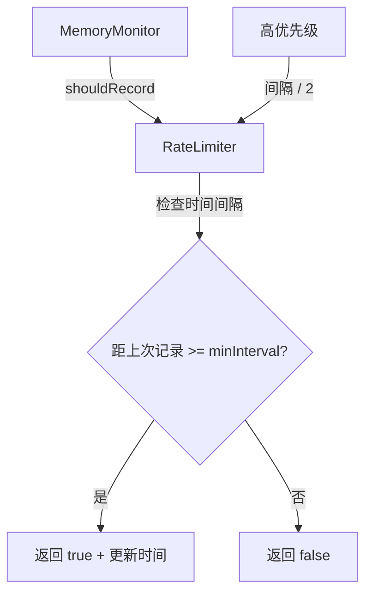

# rate-limiter.ts

> 遥测指标速率限制器，防止过于频繁地发送指标数据

## 概述
`RateLimiter` 通过维护每个指标键的最后记录时间，确保同一类型的指标不会在最小间隔内被重复记录。支持高优先级事件使用更短的间隔。主要用于 `MemoryMonitor`，避免在内存使用频繁变化时产生过多遥测数据。

## 架构图

## 主要导出

### `class RateLimiter`
- **constructor(minIntervalMs?: number)**: 默认最小间隔 60 秒。
- **shouldRecord(metricKey: string, isHighPriority?: boolean): boolean**: 判断是否允许记录。高优先级事件的间隔为正常间隔的一半。
- **forceRecord(metricKey: string)**: 强制更新记录时间（绕过限制）。
- **getTimeUntilNextAllowed(metricKey, isHighPriority?): number**: 返回距下次允许记录的毫秒数。
- **getStats()**: 返回统计信息（总指标数、最早/最新记录时间、平均间隔）。
- **reset()**: 清除所有状态。
- **cleanup(maxAgeMs?: number)**: 删除超过指定时间的旧条目，默认 1 小时。

## 核心逻辑
- 使用 `Map<string, number>` 存储每个指标键的最后记录时间戳。
- 高优先级除数为常量 `HIGH_PRIORITY_DIVISOR = 2`，即高优先级间隔为正常间隔的一半。
- `cleanup` 方法遍历 Map 删除过期条目，防止内存泄漏。

## 内部依赖
无

## 外部依赖
无
