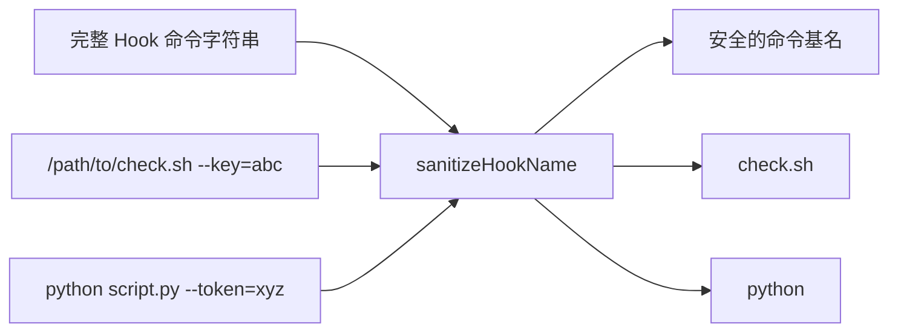

# sanitize.ts

> Hook 命令名称清洗工具，移除路径和参数中的敏感信息

## 概述
该文件提供 `sanitizeHookName` 函数，用于从 Hook 命令字符串中提取安全的命令基名。它会移除完整文件路径（可能包含用户名）和命令参数（可能包含 API 密钥、token 等敏感信息），仅保留可执行文件名。此函数在遥测指标和日志记录中被调用，确保 PII（个人可识别信息）不会泄露到遥测数据中。

## 架构图

## 主要导出

### `function sanitizeHookName(hookName: string): string`
从完整命令字符串中提取安全的命令名。

**处理规则：**
1. 空字符串或纯空白 -> `'unknown-command'`
2. 按空格拆分，取第一个部分（命令部分）
3. 若命令包含 `/` 或 `\`（路径分隔符），提取最后一段作为基名
4. 返回清洗后的命令名

**示例：**
- `"/path/to/.gemini/hooks/check-secrets.sh --api-key=abc123"` -> `"check-secrets.sh"`
- `"python /home/user/script.py --token=xyz"` -> `"python"`
- `"C:\\Windows\\System32\\cmd.exe /c secret.bat"` -> `"cmd.exe"`

## 核心逻辑
简单的字符串处理：先按空格分割取首段，再按路径分隔符分割取末段。

## 内部依赖
无

## 外部依赖
无
