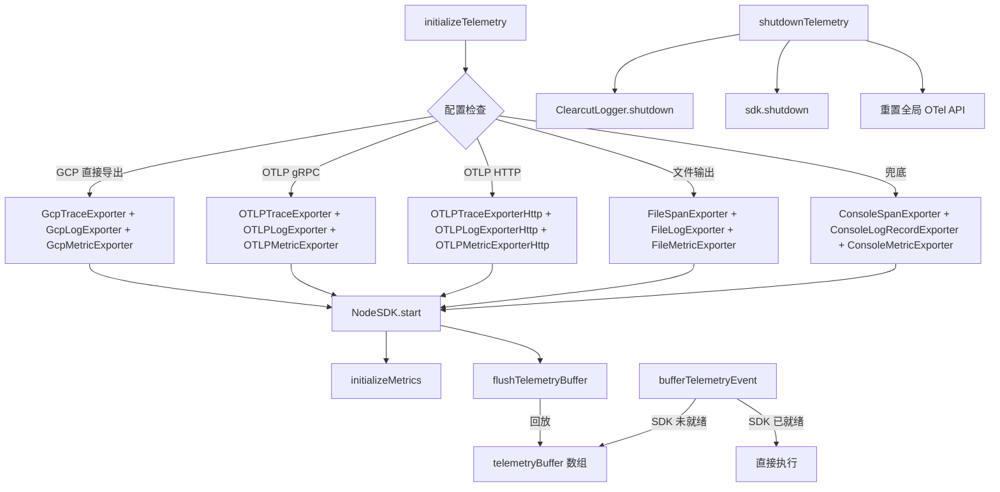

# sdk.ts

> OpenTelemetry SDK 的初始化、关闭和遥测事件缓冲管理

## 概述
该文件是整个遥测系统的引擎，负责 OpenTelemetry NodeSDK 的完整生命周期管理。根据配置选择不同的导出器（GCP 直接导出、OTLP gRPC/HTTP、文件、控制台），创建 span/log/metric 处理器，并管理 SDK 的启动和关闭。它还实现了事件缓冲机制，确保在 SDK 初始化之前产生的遥测事件不会丢失。

## 架构图

## 主要导出

### `function isTelemetrySdkInitialized(): boolean`
检查 SDK 是否已初始化。

### `function bufferTelemetryEvent(fn: () => void | Promise<void>): void`
若 SDK 已初始化则立即执行，否则推入缓冲区。

### `async function initializeTelemetry(config: Config, credentials?: JWTInput): Promise<void>`
初始化 SDK 的核心函数。处理逻辑：
1. 检查遥测是否启用。
2. 检查是否已初始化（防止重复）。
3. 处理 CLI 认证延迟初始化（监听 `post_auth` 事件）。
4. 根据配置选择导出器策略。
5. 创建 `NodeSDK` 并启动。
6. 初始化指标系统。
7. 回放缓冲事件。
8. 注册 SIGTERM/SIGINT 信号处理。

### `async function flushTelemetry(config: Config): Promise<void>`
强制刷新所有挂起的遥测数据到磁盘（用于 `/clear` 等关键操作前）。

### `async function shutdownTelemetry(config: Config, fromProcessExit?: boolean): Promise<void>`
完整关闭 SDK，包括 ClearcutLogger 关闭、SDK 关闭、全局 OTel API 禁用、事件监听器清理。

## 核心逻辑
- **导出器选择优先级**: GCP 直连 > OTLP (gRPC/HTTP) > 文件 > 控制台。
- **事件缓冲**: `telemetryBuffer` 数组在 SDK 未就绪时收集所有事件回调，`flushTelemetryBuffer` 在 SDK 启动后顺序回放。
- **CLI 认证延迟**: 当 `useCliAuth=true` 但无凭证时，注册 `post_auth` 事件监听器等待用户登录后再初始化。
- **OTLP 端点解析**: `parseOtlpEndpoint` 函数处理 URL 格式，gRPC 使用 `origin`，HTTP 使用完整 `href`。
- **关闭安全**: `shutdownTelemetry` 的 finally 块确保所有全局 API 被禁用，支持测试环境中多次启停。

## 内部依赖
- `./constants.js` — `SERVICE_NAME`
- `./metrics.js` — `initializeMetrics`
- `./clearcut-logger/clearcut-logger.js` — `ClearcutLogger`
- `./file-exporters.js` — 文件导出器
- `./gcp-exporters.js` — GCP 导出器
- `./index.js` — `TelemetryTarget`
- `./loggers.js` — `logKeychainAvailability`, `logTokenStorageInitialization`
- `../config/config.js` — `Config`
- `../code_assist/oauth2.js` — `authEvents`
- `../utils/events.js` — `coreEvents`, `CoreEvent`
- `../utils/debugLogger.js`

## 外部依赖
- `@opentelemetry/api` — `DiagLogLevel`, `diag`, `trace`, `context`, `metrics`, `propagation`
- `@opentelemetry/sdk-node` — `NodeSDK`
- `@opentelemetry/resources` — `resourceFromAttributes`
- `@opentelemetry/semantic-conventions` — `SemanticResourceAttributes`
- `@opentelemetry/sdk-trace-node` — `BatchSpanProcessor`, `ConsoleSpanExporter`
- `@opentelemetry/sdk-logs` — `BatchLogRecordProcessor`, `ConsoleLogRecordExporter`
- `@opentelemetry/sdk-metrics` — `ConsoleMetricExporter`, `PeriodicExportingMetricReader`
- `@opentelemetry/instrumentation-http` — `HttpInstrumentation`
- `@opentelemetry/exporter-trace-otlp-grpc`, `@opentelemetry/exporter-logs-otlp-grpc`, `@opentelemetry/exporter-metrics-otlp-grpc`
- `@opentelemetry/exporter-trace-otlp-http`, `@opentelemetry/exporter-logs-otlp-http`, `@opentelemetry/exporter-metrics-otlp-http`
- `@opentelemetry/otlp-exporter-base` — `CompressionAlgorithm`
- `google-auth-library` — `JWTInput`
