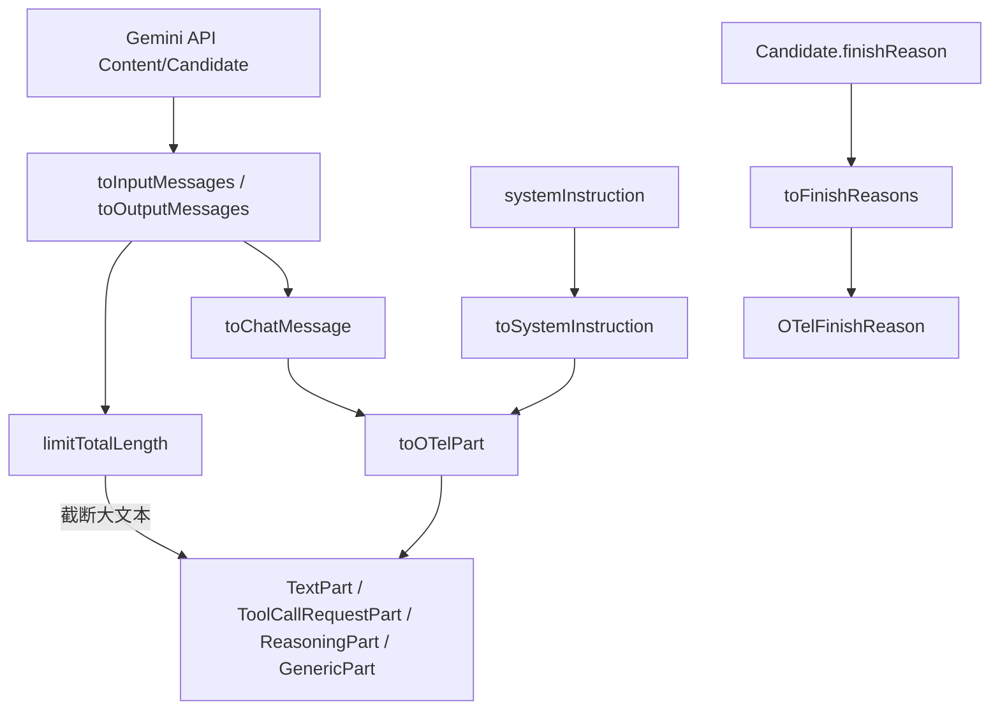

# semantic.ts

> 将 Gemini API 请求/响应格式转换为 OpenTelemetry GenAI 语义约定格式

## 概述
该文件负责将 Google Gemini API 的原始数据格式（Content、Part、Candidate 等）转换为符合 [OpenTelemetry GenAI 语义约定](https://github.com/open-telemetry/semantic-conventions/blob/main/docs/gen-ai/gen-ai-events.md) 的标准化结构。它定义了多种 Part 类型（TextPart、ToolCallRequestPart、ReasoningPart 等），并实现了全局文本长度限制（160KB），确保日志条目不超过 256KB 的 OTel 限制。

## 架构图

## 主要导出

### 转换函数
- `toInputMessages(contents: Content[]): InputMessages`: 将 Gemini Content 数组转换为 OTel 输入消息。
- `toOutputMessages(candidates?: Candidate[]): OutputMessages`: 将 Gemini Candidate 数组转换为 OTel 输出消息。
- `toSystemInstruction(systemInstruction?: ContentUnion): SystemInstruction | undefined`: 转换系统指令。
- `toFinishReasons(candidates?: Candidate[]): OTelFinishReason[]`: 提取完成原因。
- `toOutputType(requested_mime?: string): string | undefined`: 将 MIME 类型映射到 OTel 输出类型。
- `toChatMessage(content?: Content): ChatMessage`: 转换单条消息。

### 枚举类型
- `OTelRole`: `SYSTEM`, `USER`, `ASSISTANT`, `TOOL`
- `OTelOutputType`: `IMAGE`, `JSON`, `SPEECH`, `TEXT`
- `OTelFinishReason`: `STOP`, `LENGTH`, `CONTENT_FILTER`, `TOOL_CALL`, `ERROR`

### 类型定义
- `InputMessages`, `OutputMessages`, `OutputMessage`, `ChatMessage`
- `AnyPart` — 所有 Part 类型的联合
- `SystemInstruction` — `AnyPart[]`

## 核心逻辑
1. **Part 转换**: `toOTelPart` 将 Gemini Part 映射到内部 Part 类（TextPart、ToolCallRequestPart 等），保留 `thought` 字段作为 ReasoningPart。
2. **全局文本限制**: `limitTotalLength` 在总文本超过 160KB 时，按"公平份额"算法分配预算给各大文本片段并截断。
3. **角色映射**: Gemini 的 `model` 角色映射为 OTel 的 `SYSTEM`，其他标准角色直接映射。
4. **完成原因映射**: Gemini 的十几种 FinishReason 简化映射到 OTel 的 5 种标准值。

## 内部依赖
- `../utils/textUtils.js` — `truncateString`

## 外部依赖
- `@google/genai` — `FinishReason`, `Candidate`, `Content`, `ContentUnion`, `Part`, `PartUnion`
