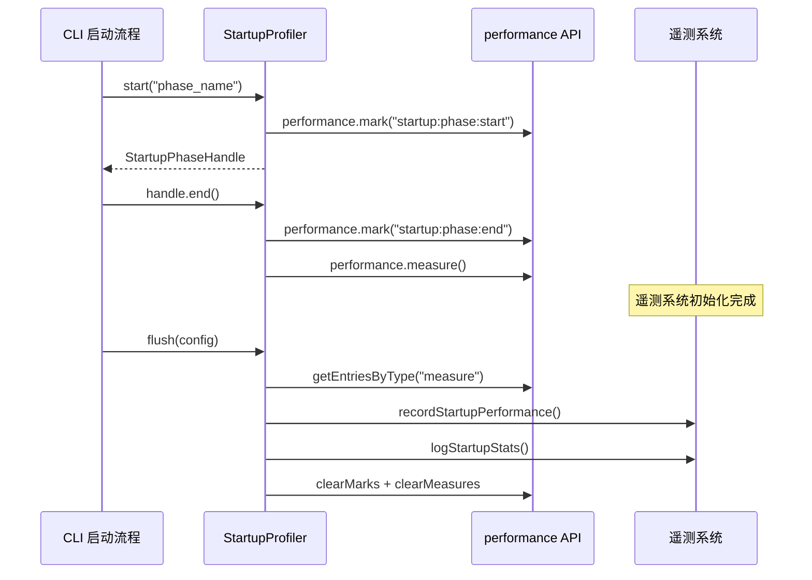

# startupProfiler.ts

> CLI 启动性能分析器，缓冲各启动阶段的耗时指标直至遥测系统就绪后发送

## 概述
`StartupProfiler` 是一个单例类，用于测量 CLI 各个启动阶段（如配置加载、工具注册、MCP 连接等）的耗时和 CPU 使用。由于启动阶段发生在遥测系统初始化之前，它使用 Node.js 的 `performance` API 缓冲测量数据，待遥测系统就绪后通过 `flush` 方法一次性发送所有启动指标。

## 架构图

## 主要导出

### `interface StartupPhaseHandle`
由 `start()` 返回的句柄，提供 `end(details?)` 方法用于结束阶段测量。

### `class StartupProfiler`
- **static getInstance()**: 获取全局单例。
- **start(phaseName, details?): StartupPhaseHandle | undefined**: 标记阶段开始，返回句柄。若阶段已活跃则返回 `undefined`。
- **flush(config: Config)**: 将所有已完成的阶段指标发送到遥测系统，同时发送 `StartupStatsEvent` 日志事件。完成后清理所有 performance marks/measures。

### `const startupProfiler`
全局单例实例。

## 核心逻辑
1. `start()` 使用 `performance.mark` 记录起始时间，同时用 `process.cpuUsage()` 记录 CPU 使用。
2. `handle.end()` 记录结束标记，用 `performance.measure` 计算持续时间，用 `process.cpuUsage(startCpuUsage)` 计算 CPU 增量。
3. `flush()` 遍历所有已完成阶段，附加操作系统信息（平台、架构、版本、是否 Docker），发送到 `recordStartupPerformance` 和 `logStartupStats`。
4. 防止重复：同名阶段活跃时再次 `start()` 会返回 `undefined`。

## 内部依赖
- `./metrics.js` — `recordStartupPerformance`
- `./loggers.js` — `logStartupStats`
- `./types.js` — `StartupStatsEvent`, `StartupPhaseStats`
- `../config/config.js` — `Config`
- `../utils/debugLogger.js`

## 外部依赖
- `node:perf_hooks` — `performance`
- `node:os` — `platform`, `arch`, `release`
- `node:fs` — `existsSync`（检测 Docker 环境）
