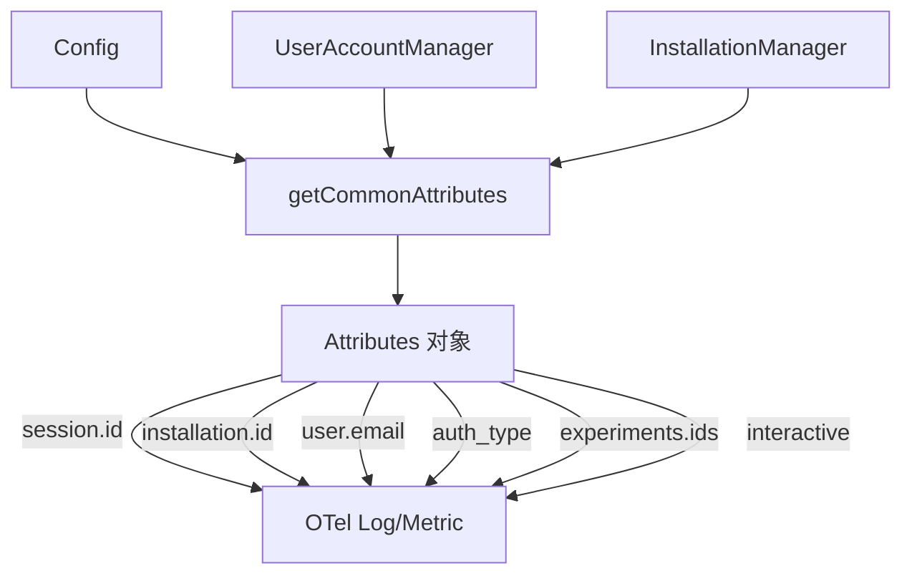

# telemetryAttributes.ts

> 生成遥测事件的公共属性（session ID、installation ID、用户邮箱、实验 ID 等）

## 概述
该文件提供 `getCommonAttributes` 函数，用于生成所有遥测事件共享的公共属性集合。这些属性作为每条 OpenTelemetry 日志和指标的基础标签，确保可按会话、安装实例、用户身份和实验分组过滤遥测数据。

## 架构图

## 主要导出

### `function getCommonAttributes(config: Config): Attributes`
返回包含以下字段的 OpenTelemetry Attributes 对象：
- `session.id` — 当前会话 ID
- `installation.id` — 安装实例 ID（匿名设备标识）
- `interactive` — 是否为交互模式
- `user.email` — Google 账户邮箱（可选，仅在已缓存时）
- `auth_type` — 认证类型（可选）
- `experiments.ids` — 实验 ID 列表（可选，非空时）

## 核心逻辑
- 使用 `UserAccountManager` 获取缓存的 Google 账户邮箱。
- 使用 `InstallationManager` 获取安装实例 ID。
- 使用扩展运算符 `...` 条件性地包含可选字段。

## 内部依赖
- `../config/config.js` — `Config`
- `../utils/installationManager.js` — `InstallationManager`
- `../utils/userAccountManager.js` — `UserAccountManager`

## 外部依赖
- `@opentelemetry/api` — `Attributes`
