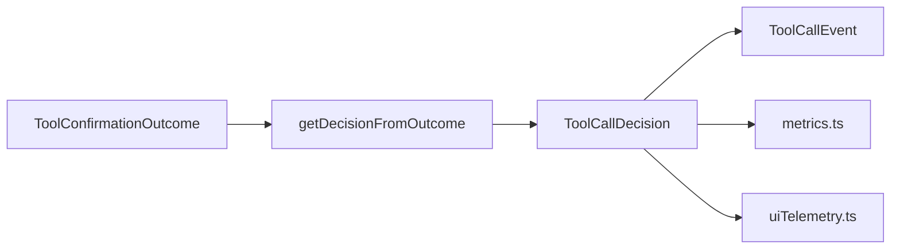

# tool-call-decision.ts

> 工具调用决策枚举和确认结果到决策类型的映射

## 概述
该文件定义了工具调用的用户决策类型（接受、拒绝、修改、自动接受），并提供将工具确认结果（`ToolConfirmationOutcome`）映射到决策类型的函数。这些决策值被记录在遥测事件和指标中，用于分析用户与工具调用的交互模式。

## 架构图

## 主要导出

### `enum ToolCallDecision`
| 值 | 含义 |
|---|---|
| `ACCEPT` | 用户接受（一次） |
| `REJECT` | 用户拒绝 |
| `MODIFY` | 用户通过编辑器修改 |
| `AUTO_ACCEPT` | 自动接受（始终允许） |

### `function getDecisionFromOutcome(outcome: ToolConfirmationOutcome): ToolCallDecision`
将工具确认结果映射到决策类型：
- `ProceedOnce` -> `ACCEPT`
- `ProceedAlways` / `ProceedAlwaysServer` / `ProceedAlwaysTool` -> `AUTO_ACCEPT`
- `ModifyWithEditor` -> `MODIFY`
- `Cancel` / 其他 -> `REJECT`

## 核心逻辑
简单的 switch-case 映射。

## 内部依赖
- `../tools/tools.js` — `ToolConfirmationOutcome`

## 外部依赖
无
