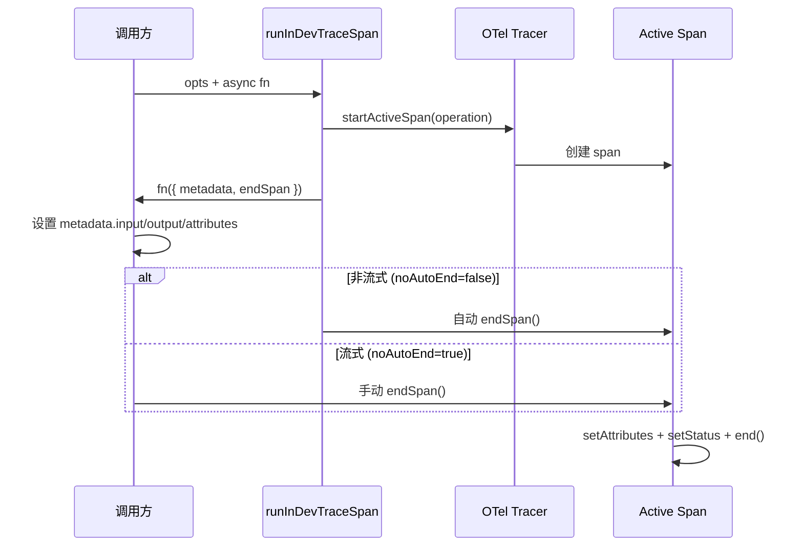

# trace.ts

> OpenTelemetry 分布式追踪工具，提供 span 管理的高级封装

## 概述
该文件提供 `runInDevTraceSpan` 函数，是对 OpenTelemetry Tracer API 的高级封装。它自动管理 span 的生命周期（创建、属性设置、状态标记、关闭），支持流式操作的手动结束模式，并自动记录 GenAI 语义约定属性（operation name、agent name、conversation ID 等）。

## 架构图

## 主要导出

### `interface SpanMetadata`
Span 元数据结构：
- `name` — Span 名称
- `input?` — 输入数据
- `output?` — 输出数据
- `error?` — 错误信息
- `attributes` — 自定义属性字典

### `async function runInDevTraceSpan<R>(opts, fn): Promise<R>`
在 OpenTelemetry span 中运行异步函数。

**参数：**
- `opts.operation` — 操作名称（`GeminiCliOperation` 枚举值）
- `opts.noAutoEnd?` — 是否禁用自动结束（用于流式操作）
- `fn({ metadata, endSpan })` — 在 span 中执行的函数

**自动设置的属性：**
- `gen_ai.operation.name`
- `gen_ai.agent.name` = `'gemini-cli'`
- `gen_ai.agent.description`
- `gen_ai.conversation.id` = sessionId

**Span 状态：**
- 正常完成 -> `SpanStatusCode.OK`
- 发生错误 -> `SpanStatusCode.ERROR` + 记录异常

## 核心逻辑
1. 通过 `trace.getTracer('gemini-cli', 'v1')` 获取 tracer。
2. `startActiveSpan` 创建活跃 span。
3. `endSpan` 闭包负责将 metadata 中的 input/output/attributes 写入 span，设置状态并关闭。
4. 异常处理：
   - `noAutoEnd=false`（默认）：finally 中自动调用 endSpan。
   - `noAutoEnd=true`：异常时手动调用 endSpan 防止泄漏。

## 内部依赖
- `./constants.js` — GenAI 属性常量、`SERVICE_NAME`、`SERVICE_DESCRIPTION`
- `../utils/safeJsonStringify.js`
- `../utils/session.js` — `sessionId`

## 外部依赖
- `@opentelemetry/api` — `diag`, `SpanStatusCode`, `trace`, `AttributeValue`, `SpanOptions`
