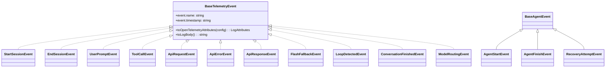

# types.ts

> 遥测事件类型的核心定义文件，包含 ~50 个事件类和接口

## 概述
该文件是整个遥测系统的类型基础，定义了所有遥测事件的数据结构。每个事件类实现 `BaseTelemetryEvent` 接口，提供 `toOpenTelemetryAttributes(config)` 和 `toLogBody()` 两个方法，分别用于生成 OpenTelemetry 日志属性和人类可读的日志文本。文件覆盖的事件类型包括会话生命周期、用户交互、API 调用、工具调用、模型路由、循环检测、扩展管理、Agent 运行、安全策略等。

## 架构图

## 主要导出

### 基础接口
- **`BaseTelemetryEvent`**: 所有事件的基接口，含 `event.name` 和 `event.timestamp`。
- **`GenAIPromptDetails`**: API 请求的 prompt 详情（prompt_id, contents, config, server）。
- **`GenAIResponseDetails`**: API 响应详情（response_id, candidates）。
- **`GenAIUsageDetails`**: Token 用量详情（input/output/cache/thought/tool/total/context_breakdown）。
- **`ServerDetails`**: 服务器地址和端口。
- **`ContextBreakdown`**: 上下文 token 分解（system_instructions, tool_definitions, history, tool_calls, mcp_servers）。
- **`StartupPhaseStats`**: 启动阶段统计数据结构。

### 会话事件
- **`StartSessionEvent`**: CLI 配置/会话开始，包含模型、工具、MCP 服务器、扩展等全部配置信息。
- **`EndSessionEvent`**: 会话结束。

### 用户交互事件
- **`UserPromptEvent`**: 用户提示，含长度和可选的完整提示内容。
- **`SlashCommandEvent`** (interface + factory): 斜杠命令。
- **`RewindEvent`**: 回退操作。
- **`ChatCompressionEvent`** (interface + factory): 聊天压缩。

### API 事件
- **`ApiRequestEvent`**: API 请求，含 prompt 详情。提供 `toLogRecord` 和 `toSemanticLogRecord` 两种日志格式。
- **`ApiResponseEvent`**: API 响应，含 token 用量和完成原因。同样双日志格式。
- **`ApiErrorEvent`**: API 错误。

### 工具调用事件
- **`ToolCallEvent`**: 工具调用，含函数名、参数、耗时、决策、MCP 信息和文件 diff 元数据。支持从 `CompletedToolCall` 构造。
- **`ToolOutputTruncatedEvent`**: 工具输出截断。
- **`ToolOutputMaskingEvent`**: 工具输出遮罩。
- **`FileOperationEvent`**: 文件操作。

### 模型路由事件
- **`ModelRoutingEvent`**: 模型路由决策（模型、来源、延迟、推理、是否失败）。
- **`ModelSlashCommandEvent`**: /model 命令。
- **`FlashFallbackEvent`**: Flash 模型回退。
- **`RipgrepFallbackEvent`**: Ripgrep 回退。

### 循环检测事件
- **`LoopDetectedEvent`**: 循环检测（含 `LoopType` 枚举）。
- **`LoopDetectionDisabledEvent`**: 循环检测被禁用。
- **`LlmLoopCheckEvent`**: LLM 循环检查结果。

### Agent 事件
- **`BaseAgentEvent`** (abstract): Agent 事件基类。
- **`AgentStartEvent`**: Agent 启动。
- **`AgentFinishEvent`**: Agent 完成（含耗时、轮次、终止原因）。
- **`RecoveryAttemptEvent`**: Agent 恢复尝试。

### 扩展事件
- **`ExtensionInstallEvent`**, **`ExtensionUninstallEvent`**, **`ExtensionUpdateEvent`**, **`ExtensionEnableEvent`**, **`ExtensionDisableEvent`**

### 安全策略事件
- **`ConsecaPolicyGenerationEvent`**: Conseca 策略生成。
- **`ConsecaVerdictEvent`**: Conseca 裁决。

### 其他事件
- **`NextSpeakerCheckEvent`**: 下一发言者检查。
- **`IdeConnectionEvent`**: IDE 连接。
- **`InvalidChunkEvent`**: 无效数据块。
- **`ContentRetryEvent`**, **`ContentRetryFailureEvent`**: 内容重试。
- **`NetworkRetryAttemptEvent`**: 网络重试。
- **`MalformedJsonResponseEvent`**: 畸形 JSON 响应。
- **`WebFetchFallbackAttemptEvent`**: Web 抓取回退。
- **`HookCallEvent`**: Hook 调用。
- **`EditStrategyEvent`**, **`EditCorrectionEvent`**: 编辑策略和纠正。
- **`ApprovalModeSwitchEvent`**, **`ApprovalModeDurationEvent`**: 审批模式切换和持续时间。
- **`PlanExecutionEvent`**: 计划执行。
- **`StartupStatsEvent`**: 启动统计。
- **`KeychainAvailabilityEvent`**: 密钥链可用性。
- **`TokenStorageInitializationEvent`**: Token 存储初始化。

### 联合类型
- **`TelemetryEvent`**: 所有遥测事件类型的联合。

### 枚举
- **`SlashCommandStatus`**: SUCCESS / ERROR
- **`LoopType`**: 循环类型（连续相同工具调用、重复句子吟唱、LLM 检测循环）
- **`IdeConnectionType`**: START / SESSION

## 核心逻辑
- 每个事件类的构造函数负责设置 `event.name`、`event.timestamp` 和事件专属字段。
- `toOpenTelemetryAttributes` 方法合并 `getCommonAttributes(config)` 和事件专属属性。
- `ApiRequestEvent` 和 `ApiResponseEvent` 额外提供 `toSemanticLogRecord` 方法，遵循 GenAI 语义约定格式（包含 `gen_ai.*` 前缀的属性）。
- `ToolCallEvent` 支持两种构造方式：从 `CompletedToolCall` 自动提取信息，或手动传入各字段。
- 敏感信息处理：`HookCallEvent` 在非 `logPrompts` 模式下会通过 `sanitizeHookName` 清洗 hook 名称。

## 内部依赖
- `./tool-call-decision.js` — `ToolCallDecision`, `getDecisionFromOutcome`
- `./metrics.js` — `getConventionAttributes`, `FileOperation`
- `./telemetryAttributes.js` — `getCommonAttributes`
- `./semantic.js` — `toInputMessages`, `toOutputMessages`, `toFinishReasons`, `toOutputType`, `toSystemInstruction`
- `./sanitize.js` — `sanitizeHookName`
- `./llmRole.js` — `LlmRole`
- `../core/contentGenerator.js` — `AuthType`
- `../core/coreToolScheduler.js` — `CompletedToolCall`
- `../scheduler/types.js` — `CoreToolCallStatus`
- `../tools/mcp-tool.js` — `DiscoveredMCPTool`
- `../utils/safeJsonStringify.js`
- `../utils/fileDiffUtils.js` — `getFileDiffFromResultDisplay`

## 外部依赖
- `@google/genai` — `Candidate`, `Content`, `GenerateContentConfig`, `GenerateContentResponseUsageMetadata`
- `@opentelemetry/api-logs` — `LogAttributes`, `LogRecord`
- `@opentelemetry/semantic-conventions` — `SemanticAttributes`
