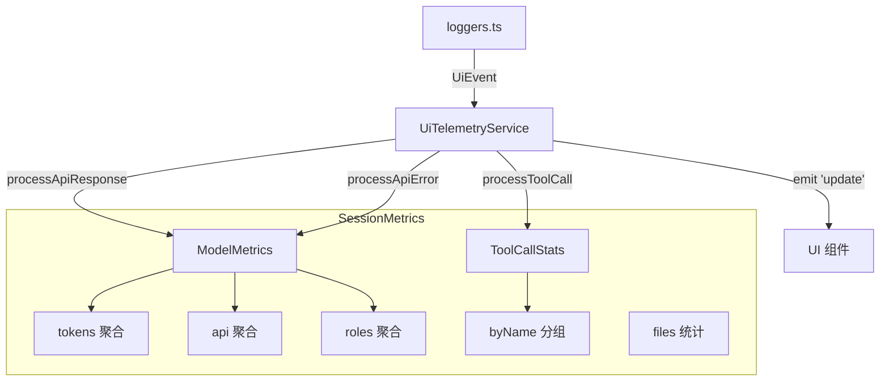

# uiTelemetry.ts

> UI 层遥测服务，实时聚合会话指标（API 请求、token 用量、工具调用统计）供界面展示

## 概述
`UiTelemetryService` 是一个基于 `EventEmitter` 的服务类，负责在内存中实时聚合当前会话的遥测指标。它接收来自 `loggers.ts` 分发的 UI 事件（API 响应、API 错误、工具调用），按模型和角色维度累计 token 用量、延迟和调用次数，以及按工具名称统计调用次数和决策分布。聚合后的数据通过 `update` 事件通知 UI 层刷新显示。

## 架构图

## 主要导出

### `type UiEvent`
UI 事件联合类型，包含标注了 `event.name` 的 `ApiResponseEvent`、`ApiErrorEvent` 和 `ToolCallEvent`。

### `interface ToolCallStats`
工具调用统计：count, success, fail, durationMs, decisions (accept/reject/modify/auto_accept)。

### `interface RoleMetrics`
按 LLM 角色聚合的指标：totalRequests, totalErrors, totalLatencyMs, tokens。

### `interface ModelMetrics`
按模型聚合的指标：api (requests/errors/latency), tokens, roles。

### `interface SessionMetrics`
会话级聚合指标：models (按模型), tools (总计 + 按名称), files (添加/删除行数)。

### `class UiTelemetryService extends EventEmitter`
- **addEvent(event: UiEvent)**: 处理事件并发出 `update` 通知。
- **getMetrics()**: 获取当前会话指标。
- **getLastPromptTokenCount() / setLastPromptTokenCount()**: 管理最后一次提示的 token 计数。
- **clear(newSessionId?)**: 重置所有指标（如 `/clear` 命令）。
- **hydrate(conversation: ConversationRecord)**: 从历史对话记录恢复指标（用于会话恢复）。

### `const uiTelemetryService`
全局单例实例。

## 核心逻辑
1. **API 响应处理**: 按模型和角色累加 token 用量（input, output, cached, thoughts, tool, total）和请求统计。`tokens.input` 计算为 `prompt - cached`。
2. **API 错误处理**: 按模型和角色累加错误计数和延迟。
3. **工具调用处理**: 累加全局和按名称的调用统计（次数、成功/失败、耗时、决策分布），同时从 metadata 提取文件行变更数据。
4. **会话恢复 (hydrate)**: 遍历历史消息记录，恢复所有模型的 token 聚合和工具调用统计。

## 内部依赖
- `./types.js` — 事件类型、事件名称常量
- `./tool-call-decision.js` — `ToolCallDecision`
- `../services/chatRecordingService.js` — `ConversationRecord`

## 外部依赖
- `node:events` — `EventEmitter`
