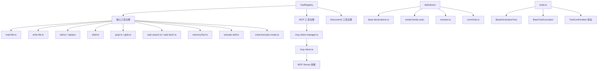

# tools 架构

> 工具系统，定义和管理 LLM 可调用的所有工具，包括核心工具、MCP 工具和动态发现工具

## 概述

`tools` 模块是 Gemini CLI 最大的子系统之一，负责定义和管理 LLM 可使用的全部工具。它包含：(1) 核心工具实现（文件读写、Shell 执行、搜索、编辑、Web 搜索等）；(2) MCP 工具集成（MCP 客户端管理、工具发现、命名空间管理）；(3) 工具注册表（ToolRegistry）负责工具的注册、查找和声明生成；(4) 工具定义系统（definitions/）支持按模型族定制工具声明。工具通过声明式模式（DeclarativeTool）定义，包括 FunctionDeclaration（给 LLM 看的 schema）和 execute 方法（实际执行逻辑）。

## 架构图



## 目录结构

```
tools/
├── tools.ts                   # 工具基类和接口定义
├── tool-registry.ts           # 工具注册表
├── tool-names.ts              # 工具名称常量和别名
├── tool-error.ts              # 工具错误类型
├── constants.ts               # 工具常量
├── mcp-tool.ts                # MCP 工具类和命名空间
├── mcp-client.ts              # MCP 客户端实现
├── mcp-client-manager.ts      # MCP 客户端管理器
├── read-file.ts               # 文件读取工具
├── read-many-files.ts         # 批量文件读取工具
├── write-file.ts              # 文件写入工具
├── edit.ts                    # 文件编辑/替换工具
├── shell.ts                   # Shell 命令执行工具
├── grep.ts                    # 正则搜索工具
├── glob.ts                    # 文件模式匹配工具
├── ls.ts                      # 目录列表工具
├── web-search.ts              # Web 搜索工具
├── web-fetch.ts               # Web 内容抓取工具
├── memoryTool.ts              # 记忆保存工具
├── activate-skill.ts          # 技能激活工具
├── enter-plan-mode.ts         # 进入计划模式工具
├── exit-plan-mode.ts          # 退出计划模式工具
├── ask-user.ts                # 询问用户工具
├── write-todos.ts             # TODO 写入工具
├── get-internal-docs.ts       # 内部文档获取工具
├── jit-context.ts             # JIT 上下文加载工具
├── trackerTools.ts            # 任务跟踪器工具
├── modifiable-tool.ts         # 可修改工具基类
├── diff-utils.ts              # Diff 工具函数
├── diffOptions.ts             # Diff 选项
├── grep-utils.ts              # Grep 工具函数
├── ripGrep.ts                 # RipGrep 集成
├── omissionPlaceholderDetector.ts  # 省略占位符检测
├── xcode-mcp-fix-transport.ts # Xcode MCP 传输修复
└── definitions/               # 工具声明定义子系统
```

## 关键文件

| 文件 | 功能 |
|------|------|
| `tools.ts` | 定义 `BaseDeclarativeTool` 基类、`BaseToolInvocation` 基类、`ToolInvocation` 接口（execute、shouldConfirmExecute、getDescription）、`ToolResult` 类型、`ToolConfirmationOutcome` 等核心抽象 |
| `tool-registry.ts` | `ToolRegistry` 类，管理所有已注册工具，提供工具查找、FunctionDeclaration 生成、MCP 工具注册、发现工具（discovered tool）执行。工具注册支持别名映射 |
| `tool-names.ts` | 所有工具名称常量（SHELL_TOOL_NAME、EDIT_TOOL_NAME 等）、参数名常量、工具别名映射（TOOL_LEGACY_ALIASES）、验证函数 |
| `mcp-client-manager.ts` | `McpClientManager` 管理多个 MCP 服务器连接的生命周期（连接、断开、重连） |
| `mcp-client.ts` | `McpClient` 实现单个 MCP 服务器的连接和交互（工具发现、提示词发现、资源发现、工具执行） |
| `mcp-tool.ts` | `DiscoveredMCPTool` 类包装 MCP 工具为声明式工具，管理 MCP 工具命名空间（mcp_serverName_toolName 格式） |
| `shell.ts` | Shell 命令执行工具，支持 PTY/非 PTY 模式、后台执行、输出长度限制 |
| `edit.ts` | 文件编辑工具（replace），支持精确字符串替换和 LLM 编辑修正 |

## 内部依赖

| 模块 | 用途 |
|------|------|
| `config/config` | Config 配置 |
| `policy/types` | ApprovalMode |
| `services/shellExecutionService` | Shell 执行服务 |
| `services/fileSystemService` | 文件系统服务 |
| `confirmation-bus` | MessageBus 确认通信 |
| `utils/schemaValidator` | Schema 参数验证 |
| `utils/debugLogger` | 调试日志 |

## 外部依赖

| 包 | 用途 |
|------|------|
| `@google/genai` | FunctionDeclaration, PartListUnion 类型 |
| `@modelcontextprotocol/sdk` | MCP SDK（Client, Transport） |
| `shell-quote` | Shell 命令解析 |
| `diff` | 文本差异计算 |
| `picomatch` | Glob 模式匹配 |
