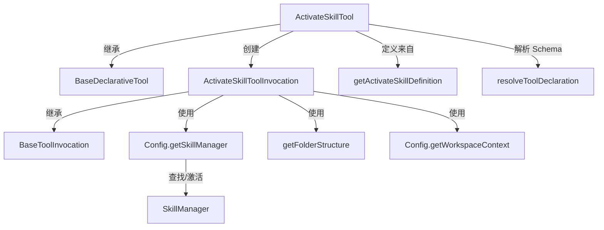

# activate-skill.ts

> 激活 Agent 技能（Skill），将技能的指令和资源加载到会话上下文中

## 概述

`activate-skill.ts` 实现了 `ActivateSkill` 工具，允许 AI Agent 在对话过程中动态激活预定义的技能。技能是一种专门化的 Agent 能力模块，包含指令（instructions）和可用资源（resources）。该工具在工具链体系中属于 `Kind.Other` 类别，负责技能的查找、确认、激活以及将技能目录注册到工作区上下文中。

设计动机：通过技能系统实现 Agent 能力的模块化扩展，用户可以创建自定义技能并在需要时按需加载，而非一次性将所有指令注入上下文。

## 架构图

## 主要导出

### `interface ActivateSkillToolParams`
- **签名**: `{ name: string }`
- **用途**: 定义激活技能所需的参数，`name` 为要激活的技能名称。

### `class ActivateSkillTool`
- **签名**: `class ActivateSkillTool extends BaseDeclarativeTool<ActivateSkillToolParams, ToolResult>`
- **用途**: 技能激活工具的声明式工具类。通过 `Config` 获取技能管理器，动态构建包含所有可用技能名称的 Schema。静态属性 `Name` 来自 `ACTIVATE_SKILL_TOOL_NAME`。
- **关键方法**:
  - `createInvocation(...)`: 创建 `ActivateSkillToolInvocation` 实例。
  - `getSchema(modelId?)`: 根据当前可用技能动态生成工具声明。

## 核心逻辑

1. **技能查找与验证**: `execute()` 方法通过 `SkillManager.getSkill(name)` 查找指定技能，若不存在则返回错误并列出所有可用技能。
2. **确认流程**: 对于非内置技能（`isBuiltin === false`），通过 `getConfirmationDetails()` 展示技能描述和资源目录结构，要求用户确认后才能激活。内置技能跳过确认。
3. **激活过程**: 调用 `SkillManager.activateSkill(name)` 激活技能，将技能所在目录添加到工作区上下文（`WorkspaceContext.addDirectory`），使 Agent 有权读取技能的捆绑资源。
4. **返回结果**: 以 XML 格式返回技能的 `instructions` 和 `available_resources`（目录结构），供 LLM 消费。
5. **目录结构缓存**: `cachedFolderStructure` 字段缓存目录结构，避免在确认和执行阶段重复计算。

## 内部依赖

| 模块 | 用途 |
|------|------|
| `../utils/getFolderStructure` | 获取技能目录的文件夹结构 |
| `../confirmation-bus/message-bus` | 消息总线，用于用户确认交互 |
| `../config/config` | 运行时配置，获取技能管理器和工作区上下文 |
| `./tools` | 基类 `BaseDeclarativeTool`、`BaseToolInvocation` 及类型定义 |
| `./tool-names` | 工具名称常量 `ACTIVATE_SKILL_TOOL_NAME` |
| `./tool-error` | 工具错误类型 `ToolErrorType` |
| `./definitions/coreTools` | 工具定义 `getActivateSkillDefinition` |
| `./definitions/resolver` | Schema 解析 `resolveToolDeclaration` |

## 外部依赖

| 包 | 用途 |
|----|------|
| `node:path` | 路径处理，获取技能目录的父目录 |
