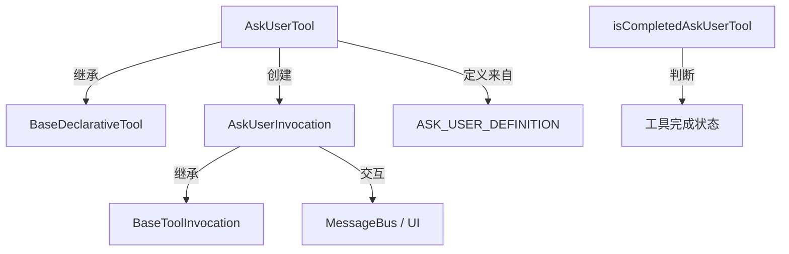

# ask-user.ts

> 向用户提问并收集回答的交互工具

## 概述

`ask-user.ts` 实现了 `AskUser` 工具，允许 AI Agent 在执行过程中向用户提出问题并等待回答。支持自由文本和选择题两种问题类型。该工具属于 `Kind.Communicate` 类别，是 Agent 与用户之间进行结构化交互的核心通道。

设计动机：在 Agent 执行任务时，某些决策需要用户输入（如选择方案、确认意图等）。该工具提供了一种标准化的提问-回答机制，而非依赖非结构化的自然语言对话。

## 架构图

## 主要导出

### `interface AskUserParams`
- **签名**: `{ questions: Question[] }`
- **用途**: 定义提问参数，`questions` 是问题列表，每个 `Question` 包含问题文本、类型、选项等。

### `class AskUserTool`
- **签名**: `class AskUserTool extends BaseDeclarativeTool<AskUserParams, ToolResult>`
- **用途**: 提问工具的声明式工具类。
- **关键方法**:
  - `validateToolParamValues(params)`: 验证问题列表非空、选择题有 2-4 个选项、选项结构合法。
  - `validateBuildAndExecute(params, abortSignal)`: 重写以在参数验证失败时清空 `returnDisplay`。

### `class AskUserInvocation`
- **签名**: `class AskUserInvocation extends BaseToolInvocation<AskUserParams, ToolResult>`
- **用途**: 提问工具的调用实例，管理确认流程和用户回答收集。
- **关键方法**:
  - `shouldConfirmExecute(abortSignal)`: 返回 `ask_user` 类型的确认详情，将问题展示给用户。
  - `execute(signal)`: 根据用户是否回答、是否取消，返回不同结果。

### `function isCompletedAskUserTool(name, status)`
- **签名**: `(name: string, status: string) => boolean`
- **用途**: 判断给定的工具名称和状态是否对应一个已完成的 AskUser 调用。

## 核心逻辑

1. **参数验证**: 校验问题列表非空；`choice` 类型必须有 2-4 个选项；每个选项需要非空的 `label` 和 `description`。
2. **确认机制**: `shouldConfirmExecute()` 始终返回确认详情（不走策略判断），将问题直接展示给用户，通过 `onConfirm` 回调收集用户回答。
3. **执行逻辑**:
   - 用户取消：返回 "User dismissed" 并标记 `dismissed: true`。
   - 用户回答：将答案以 JSON 格式返回给 LLM，同时生成可读的 `returnDisplay`。
   - 用户空提交：标记 `empty_submission: true`。
4. **遥测数据**: `data` 字段包含问题类型、是否取消、回答数量等指标。

## 内部依赖

| 模块 | 用途 |
|------|------|
| `./tools` | 基类及确认相关类型 |
| `./tool-error` | 错误类型 `ToolErrorType` |
| `../confirmation-bus/message-bus` | 消息总线 |
| `../confirmation-bus/types` | `QuestionType`、`Question` 类型 |
| `./tool-names` | 工具名称常量 |
| `./definitions/coreTools` | 工具定义 `ASK_USER_DEFINITION` |
| `./definitions/resolver` | Schema 解析 |

## 外部依赖

无外部第三方依赖。
