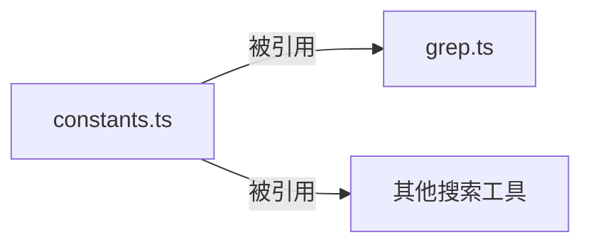

# constants.ts

> 定义工具模块共享的搜索相关常量

## 概述

`constants.ts` 是一个极其简洁的常量定义文件，为搜索类工具（主要是 `grep.ts`）提供默认配置值。它将搜索行为的默认参数集中管理，使得多个工具可以引用相同的默认值，确保一致性。

## 架构图

## 主要导出

### `DEFAULT_TOTAL_MAX_MATCHES`
- **签名**: `const DEFAULT_TOTAL_MAX_MATCHES = 100`
- **用途**: grep 搜索的默认最大匹配总数。当用户未指定 `total_max_matches` 参数时使用此值，防止搜索结果过大导致 LLM 上下文溢出。

### `DEFAULT_SEARCH_TIMEOUT_MS`
- **签名**: `const DEFAULT_SEARCH_TIMEOUT_MS = 30000`
- **用途**: 搜索操作的默认超时时间（30 秒）。用于创建 `AbortController` 的超时控制，防止搜索操作无限期挂起。

## 核心逻辑

无复杂逻辑，仅为常量声明。

## 内部依赖

无。

## 外部依赖

无。
