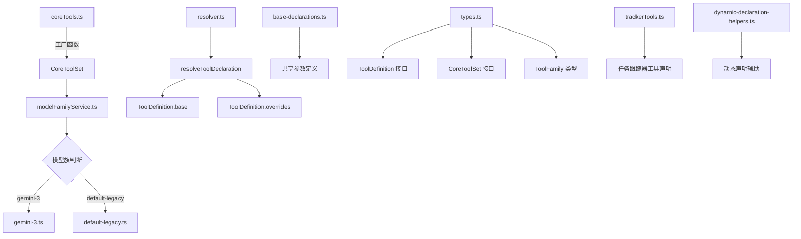

# definitions 架构

> 工具声明定义子系统，按模型族管理工具的 FunctionDeclaration 及其参数 schema

## 概述

`definitions` 目录实现了工具声明的定义和解析机制。每个工具有一个基础声明（base FunctionDeclaration），可以按模型族（model family）提供差异化的覆盖版本。`ToolDefinition` 接口定义了 base + overrides 结构，`resolveToolDeclaration` 根据当前模型解析最终声明。`CoreToolSet` 定义了所有核心工具的显式映射，`model-family-sets/` 下为不同模型族提供完整的工具集实现。`coreTools.ts` 作为工厂函数按模型族创建工具实例。

## 架构图



## 目录结构

```
definitions/
├── types.ts                         # 类型定义（ToolDefinition, CoreToolSet, ToolFamily）
├── resolver.ts                      # 工具声明解析器
├── base-declarations.ts             # 共享基础参数声明
├── coreTools.ts                     # 核心工具工厂函数
├── modelFamilyService.ts            # 模型族识别服务
├── trackerTools.ts                  # 任务跟踪器工具声明
├── dynamic-declaration-helpers.ts   # 动态声明辅助函数
└── model-family-sets/               # 按模型族组织的工具集
```

## 关键文件

| 文件 | 功能 |
|------|------|
| `types.ts` | 定义 `ToolFamily` 类型（'default-legacy' / 'gemini-3'）、`ToolDefinition` 接口（base + optional overrides）、`CoreToolSet` 接口（所有核心工具的显式映射，包括 read_file、write_file、grep_search 等 17 个工具） |
| `resolver.ts` | `resolveToolDeclaration` 函数，接收 ToolDefinition 和可选 modelId，返回合并后的最终 FunctionDeclaration |
| `base-declarations.ts` | 定义跨模型族共享的参数声明（如 file_path、dir_path、pattern 等公共参数） |
| `coreTools.ts` | 工具工厂函数，根据 modelFamilyService 判断当前模型族，从对应的 model-family-set 创建工具实例 |
| `modelFamilyService.ts` | 模型族识别服务，根据模型 ID 判断属于哪个模型族 |
| `trackerTools.ts` | 定义任务跟踪器的 FunctionDeclaration（create_task、update_task、get_task、list_tasks、add_dependency、visualize） |
| `dynamic-declaration-helpers.ts` | 辅助函数用于运行时动态构建 FunctionDeclaration |

## 内部依赖

| 模块 | 用途 |
|------|------|
| `tools/tool-names` | 工具名称常量和参数名常量 |

## 外部依赖

| 包 | 用途 |
|------|------|
| `@google/genai` | FunctionDeclaration 类型 |
