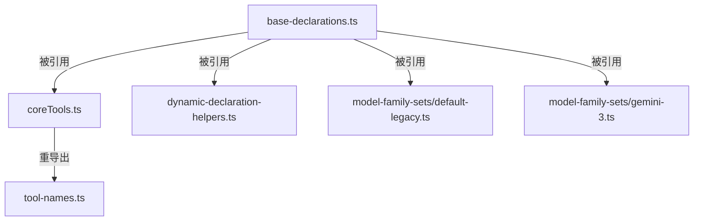

# base-declarations.ts

> 所有核心工具的名称常量和参数名称常量的身份注册表，位于依赖树最底层以防止循环导入。

## 概述
本文件是工具定义系统的基础层，定义了所有核心工具的名称常量（如 `GLOB_TOOL_NAME = 'glob'`）和工具参数名称常量（如 `PARAM_FILE_PATH = 'file_path'`）。这些常量被整个工具系统引用，放在依赖树最底层可以避免循环导入问题。

## 架构图

## 主要导出

### 工具名称常量（17 个）
`GLOB_TOOL_NAME`, `GREP_TOOL_NAME`, `LS_TOOL_NAME`, `READ_FILE_TOOL_NAME`, `SHELL_TOOL_NAME`, `WRITE_FILE_TOOL_NAME`, `EDIT_TOOL_NAME`, `WEB_SEARCH_TOOL_NAME`, `WRITE_TODOS_TOOL_NAME`, `WEB_FETCH_TOOL_NAME`, `READ_MANY_FILES_TOOL_NAME`, `MEMORY_TOOL_NAME`, `GET_INTERNAL_DOCS_TOOL_NAME`, `ACTIVATE_SKILL_TOOL_NAME`, `ASK_USER_TOOL_NAME`, `EXIT_PLAN_MODE_TOOL_NAME`, `ENTER_PLAN_MODE_TOOL_NAME`

### 共享参数名常量（8 个）
`PARAM_FILE_PATH`, `PARAM_DIR_PATH`, `PARAM_PATTERN`, `PARAM_CASE_SENSITIVE`, `PARAM_RESPECT_GIT_IGNORE`, `PARAM_RESPECT_GEMINI_IGNORE`, `PARAM_FILE_FILTERING_OPTIONS`, `PARAM_DESCRIPTION`

### 工具专属参数名常量（~40 个）
涵盖 read_file / write_file / grep / edit / shell / web_search / web_fetch / read_many / memory / todos / docs / ask_user / plan_mode / skill 各工具的参数。

## 核心逻辑
纯常量定义文件，无逻辑。

## 内部依赖
无

## 外部依赖
无
