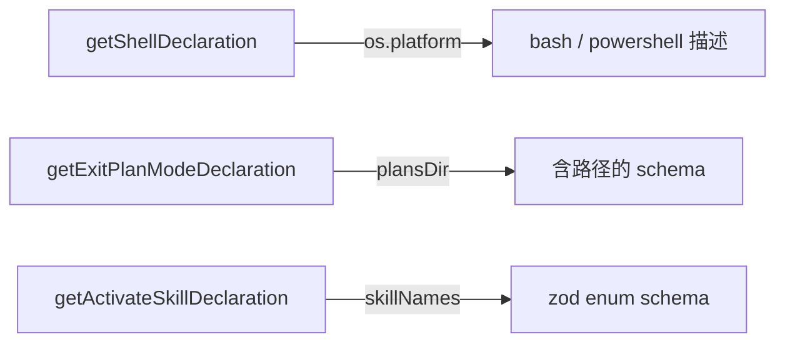

# dynamic-declaration-helpers.ts

> 依赖运行时状态的动态工具声明生成器（Shell、退出计划模式、激活技能）。

## 概述
本文件提供了三个需要运行时参数才能生成的工具 `FunctionDeclaration` 构建函数。Shell 工具需要 OS 平台信息和交互模式开关；退出计划模式需要计划目录路径；激活技能需要可用技能名列表。这些函数被 `coreTools.ts` 和模型族工具集共用。

## 架构图

## 主要导出

### 函数
- `getShellToolDescription(enableInteractiveShell, enableEfficiency)`: 生成平台相关的 Shell 工具描述
- `getCommandDescription()`: 生成平台相关的 command 参数描述
- `getShellDeclaration(enableInteractiveShell, enableEfficiency)`: Shell 工具完整 FunctionDeclaration
- `getExitPlanModeDeclaration(plansDir)`: 退出计划模式 FunctionDeclaration
- `getActivateSkillDeclaration(skillNames)`: 激活技能 FunctionDeclaration，使用 zod enum + zodToJsonSchema

## 核心逻辑
1. **Shell 平台适配**：Windows 使用 `powershell.exe -NoProfile -Command`，其他使用 `bash -c`
2. **效率指南**：`enableEfficiency` 时附加静默标志和分页禁用建议
3. **技能 schema**：使用 `zod.enum` 生成精确的可选值列表，空列表时使用 `z.string()`

## 内部依赖
- `./base-declarations.ts` - 工具名和参数名常量

## 外部依赖
- `@google/genai` - `FunctionDeclaration`
- `node:os` - 平台检测
- `zod` - Schema 定义
- `zod-to-json-schema` - Zod 到 JSON Schema 转换
