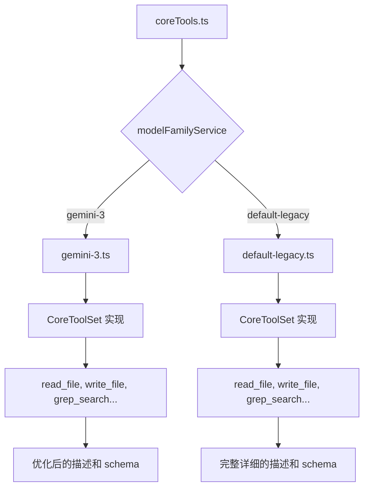

# model-family-sets 架构

> 按模型族提供差异化的工具声明集合，优化不同模型的工具使用体验

## 概述

`model-family-sets` 目录包含按模型族（Model Family）组织的完整工具声明集合。每个文件实现 `CoreToolSet` 接口，为对应模型族提供所有核心工具的 `FunctionDeclaration`。目前支持两个模型族：`default-legacy`（旧版模型的完整描述）和 `gemini-3`（Gemini 3+ 模型的优化声明）。不同模型族的声明可能在参数描述、schema 结构等方面有所差异，以适配模型的能力特点。

## 架构图



## 目录结构

```
model-family-sets/
├── default-legacy.ts    # 旧版模型的工具声明集
└── gemini-3.ts          # Gemini 3+ 模型的工具声明集
```

## 关键文件

| 文件 | 功能 |
|------|------|
| `default-legacy.ts` | 为旧版模型提供完整的工具声明集合（`CoreToolSet` 实现）。包含所有 17 个核心工具的 FunctionDeclaration，每个工具都有详尽的描述文本和完整的参数 schema。Shell 工具声明是工厂函数，根据交互式 Shell 和效率模式动态调整 |
| `gemini-3.ts` | 为 Gemini 3+ 模型提供优化的工具声明集合。针对现代模型的更强理解能力，可能简化描述文本或调整参数结构。同样实现完整的 `CoreToolSet` 接口 |

## 内部依赖

| 模块 | 用途 |
|------|------|
| `definitions/types` | CoreToolSet 接口 |
| `tools/tool-names` | 所有工具名称常量和参数名常量 |

## 外部依赖

| 包 | 用途 |
|------|------|
| `@google/genai` | FunctionDeclaration 类型（Type, Schema 等） |
