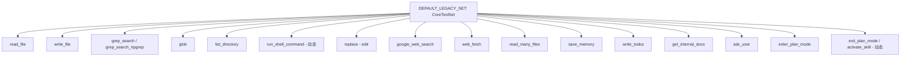

# default-legacy.ts

> 默认/遗留模型族的完整工具声明清单，包含所有核心工具的描述和 JSON Schema。

## 概述
本文件定义了 `DEFAULT_LEGACY_SET`，即默认模型族（非 Gemini 3）的完整 `CoreToolSet` 实现。包含约 20 个工具的完整 `FunctionDeclaration`，涵盖文件读写、搜索、Shell 执行、Web 搜索/获取、编辑、记忆、待办、文档、用户问答、计划模式等。每个工具的 description 和 parametersJsonSchema 在此集中定义，便于审计和维护。

## 架构图

## 主要导出

### `DEFAULT_LEGACY_SET: CoreToolSet`
完整的工具声明集，特点：
- `grep_search` 和 `grep_search_ripgrep` 两个变体（ripgrep 版包含更多参数如 case_sensitive、fixed_strings、context 等）
- `replace` (edit) 工具的描述非常详细，包含参数要求、示例和注意事项
- `write_todos` 包含完整的方法论文档和使用示例
- `run_shell_command`、`exit_plan_mode`、`activate_skill` 委托给 `dynamic-declaration-helpers.ts`

## 核心逻辑
纯声明文件。所有 schema 使用 JSON Schema 格式定义参数类型、描述和必选字段。

## 内部依赖
- `../types.ts` - `CoreToolSet`
- `../base-declarations.ts` - 所有名称/参数常量
- `../dynamic-declaration-helpers.ts` - 动态工具声明函数

## 外部依赖
无
