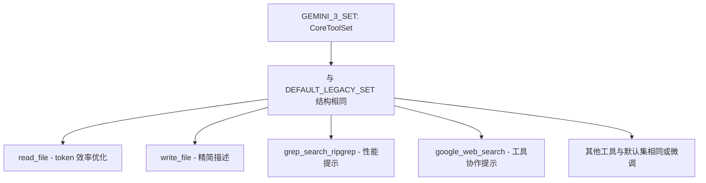

# gemini-3.ts

> Gemini 3 模型族的工具声明清单，针对新模型优化了部分工具描述和参数。

## 概述
本文件定义了 `GEMINI_3_SET`，即 Gemini 3 模型族的完整 `CoreToolSet` 实现。整体结构与 `DEFAULT_LEGACY_SET` 一致，但在以下工具上进行了模型特定的优化：

1. **read_file** - 强调 token 效率：要求使用 `start_line/end_line` 进行精准读取，提及自动截断限制
2. **write_file** - 精简描述，建议大文件用 `replace` 工具
3. **grep_search_ripgrep** - 新增 "PREFERRED over shell grep" 的性能提示
4. **google_web_search** - 新增与 `web_fetch` 配合使用的建议
5. **web_fetch** - 优化描述，强调分析指令和 GitHub URL 自动转换
6. **save_memory** - 精简描述，新增与 `write_file` 的区别说明
7. **ask_user** - 新增 multi-select 偏好建议
8. **replace** (edit) - 精简描述

## 架构图

## 主要导出

### `GEMINI_3_SET: CoreToolSet`
Gemini 3 优化的工具声明集。主要差异：
- `read_file.description` 包含 `DEFAULT_MAX_LINES_TEXT_FILE`、`MAX_LINE_LENGTH_TEXT_FILE`、`MAX_FILE_SIZE_MB` 的具体限制值
- `write_file.description` 提及 `replace` 工具作为大文件编辑的替代
- `grep_search_ripgrep.description` 包含 "FAST and optimized, powered by ripgrep. PREFERRED over standard run_shell_command" 提示
- `google_web_search.description` 建议 "follow up by using web_fetch on the provided URI"

## 核心逻辑
纯声明文件。通过不同的 description 文本引导 Gemini 3 模型更高效地使用工具。

## 内部依赖
- `../types.ts` - `CoreToolSet`
- `../base-declarations.ts` - 所有名称/参数常量
- `../dynamic-declaration-helpers.ts` - 动态工具声明函数
- `../../../utils/constants.ts` - `DEFAULT_MAX_LINES_TEXT_FILE` 等常量

## 外部依赖
无
