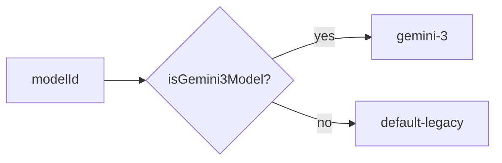

# modelFamilyService.ts

> 模型 ID 到工具族（ToolFamily）的单一映射源。

## 概述
本文件提供 `getToolFamily` 函数，根据模型 ID 确定应使用的工具族。当前支持两个族：`gemini-3`（通过 `isGemini3Model` 检测）和 `default-legacy`（兜底）。这是工具定义系统中确定"哪个模型用哪套工具描述"的唯一决策点。

## 架构图

## 主要导出

### `getToolFamily(modelId?: string): ToolFamily`
- 无 modelId 时返回 `default-legacy`
- Gemini 3 模型返回 `gemini-3`
- 其他模型返回 `default-legacy`

## 核心逻辑
单一职责的映射函数，委托 `isGemini3Model` 进行模型族检测。

## 内部依赖
- `../../config/models.ts` - `isGemini3Model`
- `./types.ts` - `ToolFamily`

## 外部依赖
无
