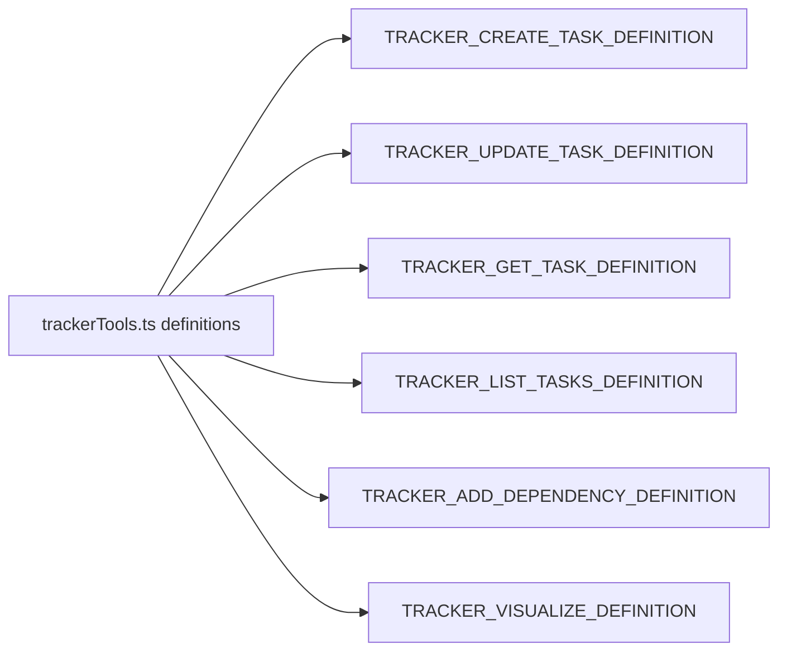

# trackerTools.ts (definitions)

> 任务追踪器六个工具的 ToolDefinition 声明（schema 和描述）。

## 概述
本文件定义了任务追踪器六个工具的 `ToolDefinition` 对象，每个仅包含 `base` 声明（无 model-specific overrides）。涵盖：创建任务、更新任务、获取任务、列举任务、添加依赖和可视化。

## 架构图

## 主要导出

### ToolDefinition 常量（6 个）
- `TRACKER_CREATE_TASK_DEFINITION` - 创建任务：title + description + type(epic/task/bug)，可选 parentId 和 dependencies
- `TRACKER_UPDATE_TASK_DEFINITION` - 更新任务：id 必选，其余可选更新字段
- `TRACKER_GET_TASK_DEFINITION` - 获取任务：按 6 字符 hex ID 查询
- `TRACKER_LIST_TASKS_DEFINITION` - 列举任务：可按 status/type/parentId 过滤
- `TRACKER_ADD_DEPENDENCY_DEFINITION` - 添加依赖：taskId + dependencyId
- `TRACKER_VISUALIZE_DEFINITION` - 可视化：无参数

## 核心逻辑
纯声明文件，无运行时逻辑。每个定义仅有 `base` 属性，不支持 model-specific overrides。

## 内部依赖
- `./types.ts` - `ToolDefinition`
- `../tool-names.ts` - Tracker 工具名称常量

## 外部依赖
无
