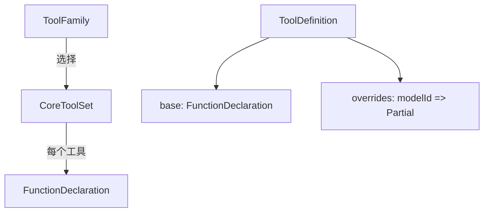

# types.ts (definitions)

> 工具定义系统的核心类型：ToolFamily、ToolDefinition 和 CoreToolSet 接口。

## 概述
本文件定义了工具定义系统的三个核心类型。`ToolFamily` 标识支持的模型族，`ToolDefinition` 描述单个工具的 base 声明和可选的模型特定覆盖，`CoreToolSet` 定义了一个完整模型族应提供的所有核心工具声明的形状。

## 架构图

## 主要导出

### 类型
- `ToolFamily = 'default-legacy' | 'gemini-3'` - 支持的模型族

### 接口
- `ToolDefinition` - 工具定义：`base`(必选 FunctionDeclaration) + `overrides?`(modelId => Partial<FunctionDeclaration>)
- `CoreToolSet` - 完整工具集接口，包含所有核心工具的声明（含 3 个动态工具函数：`run_shell_command`, `exit_plan_mode`, `activate_skill`）

## 核心逻辑
纯类型定义文件。`CoreToolSet` 中大部分工具直接是 `FunctionDeclaration`，三个动态工具是接受运行时参数的函数。

## 内部依赖
无

## 外部依赖
- `@google/genai` - `FunctionDeclaration`
