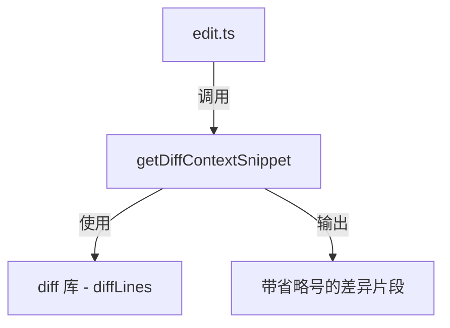

# diff-utils.ts

> 生成带上下文的差异摘要片段，用于编辑结果展示

## 概述

`diff-utils.ts` 提供了一个实用函数 `getDiffContextSnippet`，用于在两段文本之间生成差异的上下文摘要。与完整的 diff 不同，该函数只提取变更区域周围的若干行上下文，并用 `...` 省略无变化的部分。主要被 `edit.ts` 在编辑完成后调用，将编辑结果的关键片段反馈给 LLM，使其无需再花一轮调用 `read_file` 来验证编辑是否生效。

## 架构图

## 主要导出

### `function getDiffContextSnippet(originalContent, newContent, contextLines?)`
- **签名**: `(originalContent: string, newContent: string, contextLines?: number) => string`
- **用途**: 生成两段文本差异的上下文摘要。`contextLines` 默认为 5，表示变更行前后各展示 5 行上下文。

## 核心逻辑

1. **空内容处理**: 若 `originalContent` 为空，直接返回 `newContent`（通常对应新建文件）。
2. **行级差异计算**: 使用 `Diff.diffLines()` 计算行级别的变更。
3. **变更范围收集**: 遍历变更列表，记录所有新增（`added`）和删除（`removed`）行在新内容中对应的行范围。
4. **上下文扩展**: 对每个变更范围向前后各扩展 `contextLines` 行，确保不越界。
5. **范围合并**: 对扩展后的范围按起始位置排序，合并重叠的范围，避免输出重复内容。
6. **片段拼接**: 遍历合并后的范围，提取对应行，在不连续的范围之间插入 `...` 省略符号。
7. **尾部省略**: 若最后一个范围未覆盖到文件末尾，追加 `...`。

## 内部依赖

无。

## 外部依赖

| 包 | 用途 |
|----|------|
| `diff` | 核心 diff 算法库，提供 `diffLines` 方法 |
