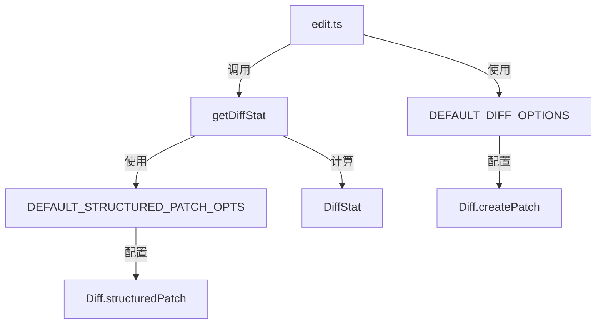

# diffOptions.ts

> 提供 diff 操作的默认选项和差异统计功能

## 概述

`diffOptions.ts` 提供两类功能：一是定义 `diff` 库的默认配置选项，二是提供 `getDiffStat` 函数用于计算编辑操作的统计信息（增删行数、字符数）。该文件是编辑工具 (`edit.ts`) 的重要辅助模块，为 diff 展示和遥测数据收集提供标准化的配置和统计能力。

## 架构图

## 主要导出

### `DEFAULT_DIFF_OPTIONS`
- **签名**: `const DEFAULT_DIFF_OPTIONS: Diff.CreatePatchOptionsNonabortable`
- **值**: `{ context: 3, ignoreWhitespace: false }`
- **用途**: `Diff.createPatch` 的默认选项，用于生成 unified diff 文本。上下文行数为 3，不忽略空白字符。

### `function getDiffStat(fileName, oldStr, aiStr, userStr)`
- **签名**: `(fileName: string, oldStr: string, aiStr: string, userStr: string) => DiffStat`
- **用途**: 计算编辑操作的双维度差异统计。

## 核心逻辑

`getDiffStat` 执行两次结构化 diff：

1. **模型 diff** (`oldStr` -> `aiStr`): 计算 AI 提议的修改中新增/删除的行数和字符数，字段前缀为 `model_`。
2. **用户 diff** (`aiStr` -> `userStr`): 计算用户在 AI 提议基础上的进一步修改，字段前缀为 `user_`。

内部通过 `Diff.structuredPatch` 获取结构化补丁数据，遍历每个 hunk 的行，以 `+` 开头计为新增、`-` 开头计为删除，并累计字符数（不含前缀符号）。

返回的 `DiffStat` 包含 8 个字段：`model_added_lines`、`model_removed_lines`、`model_added_chars`、`model_removed_chars`、`user_added_lines`、`user_removed_lines`、`user_added_chars`、`user_removed_chars`。

## 内部依赖

| 模块 | 用途 |
|------|------|
| `./tools` | `DiffStat` 类型定义 |

## 外部依赖

| 包 | 用途 |
|----|------|
| `diff` | 核心 diff 算法库，提供 `structuredPatch` 方法 |
