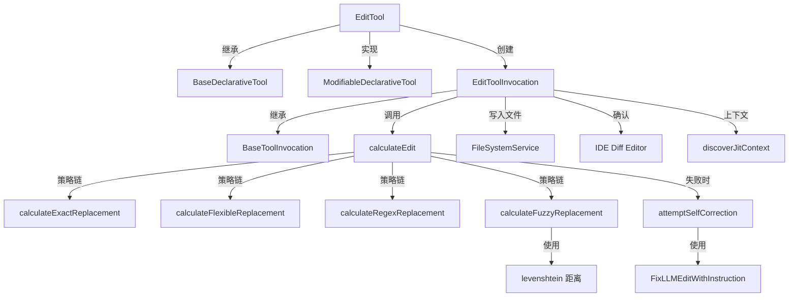

# edit.ts

> 文件编辑工具，支持精确替换、灵活匹配、正则匹配和模糊匹配四种策略

## 概述

`edit.ts` 是整个工具链中最核心也最复杂的文件（约 1300 行），实现了 `Edit` 工具，允许 AI Agent 对文件进行创建和修改操作。该工具采用多层替换策略（精确 -> 灵活 -> 正则 -> 模糊），并内置 LLM 自修复机制，在替换失败时自动尝试纠正。它还支持 IDE 集成（差异对比编辑器）、用户手动修改覆盖、JIT 上下文发现等高级功能。

设计动机：LLM 生成的替换文本经常存在空白字符、缩进不一致等问题，单一的精确匹配策略会导致大量编辑失败。多层策略设计显著提高了编辑成功率，而模糊匹配和 LLM 自修复进一步兜底。

## 架构图

## 主要导出

### `interface EditToolParams`
- **签名**: `{ file_path: string, old_string: string, new_string: string, allow_multiple?: boolean, instruction?: string, modified_by_user?: boolean, ai_proposed_content?: string }`
- **用途**: 编辑操作参数。`old_string` 为空时创建新文件；`allow_multiple` 允许替换多个匹配项。

### `function applyReplacement(currentContent, oldString, newString, isNewFile)`
- **签名**: `(currentContent: string | null, oldString: string, newString: string, isNewFile: boolean) => string`
- **用途**: 执行基础的字面量替换操作，使用 `safeLiteralReplace` 安全处理 `$` 序列。

### `function isEditToolParams(args)`
- **签名**: `(args: unknown) => args is EditToolParams`
- **用途**: 类型守卫，验证给定对象是否符合 `EditToolParams` 结构。

### `async function calculateReplacement(config, context)`
- **签名**: `(config: Config, context: ReplacementContext) => Promise<ReplacementResult>`
- **用途**: 核心替换计算函数，按优先级链式执行四种匹配策略。

### `function getErrorReplaceResult(params, occurrences, finalOldString, finalNewString)`
- **签名**: `(params: EditToolParams, occurrences: number, finalOldString: string, finalNewString: string) => ErrorObject | undefined`
- **用途**: 根据替换结果判断是否存在错误（0 匹配、多匹配、无变化）。

### `class EditTool`
- **签名**: `class EditTool extends BaseDeclarativeTool<EditToolParams, ToolResult> implements ModifiableDeclarativeTool<EditToolParams>`
- **用途**: 编辑工具的声明式工具类，同时实现 `ModifiableDeclarativeTool` 接口以支持用户在 IDE 中修改提议内容。

## 核心逻辑

### 四层替换策略

1. **精确匹配 (Exact)**: 直接搜索 `old_string` 在文件内容中的出现次数。使用 `safeLiteralReplace` 避免 `$` 转义问题。CRLF 统一为 LF 处理。
2. **灵活匹配 (Flexible)**: 按行 trim 后逐行比较，忽略前导/尾随空白。匹配成功后根据首行缩进重新对齐替换内容。
3. **正则匹配 (Regex)**: 将 `old_string` 分词，对分隔符（括号、冒号等）加空格分割，然后用 `\s*` 连接各 token，构建灵活的多行正则表达式。
4. **模糊匹配 (Fuzzy)**: 使用滑动窗口 + Levenshtein 距离，允许最多 10% 的加权差异（空白差异权重为 10%）。有复杂度限制（`sourceLines * oldString^2 <= 4e8`）避免性能问题。支持多个非重叠匹配。

### LLM 自修复机制

当所有替换策略都失败时，`attemptSelfCorrection` 会：
1. 检测文件是否在计算期间被外部修改（通过 SHA256 哈希比较）。
2. 调用 `FixLLMEditWithInstruction`，由辅助 LLM 根据 instruction 和错误信息生成修正的 search/replace 对。
3. 用修正后的参数重新执行 `calculateReplacement`。
4. 记录修复成功/失败的遥测事件。

### 文件创建与编辑确认

- **新建文件**: `old_string === ''` 且文件不存在时创建新文件，自动创建父目录。
- **IDE 集成**: 非 `AUTO_EDIT` 模式下，通过 `IdeClient.openDiff()` 在 IDE 中打开差异对比编辑器，用户可直接修改提议内容。
- **行尾处理**: 检测并保留原始文件的行尾风格（CRLF/LF），新文件使用 OS 默认值。

### 占位符检测

`validateToolParamValues` 中调用 `detectOmissionPlaceholders` 检测 `new_string` 中是否包含省略占位符（如 "rest of methods ..."），防止 LLM 偷懒不写完整代码。

## 内部依赖

| 模块 | 用途 |
|------|------|
| `./tools` | 基类及类型定义（`BaseDeclarativeTool`、`BaseToolInvocation`、`Kind.Edit` 等） |
| `./diffOptions` | `DEFAULT_DIFF_OPTIONS`、`getDiffStat` |
| `./diff-utils` | `getDiffContextSnippet` |
| `./modifiable-tool` | `ModifiableDeclarativeTool`、`ModifyContext` 接口 |
| `./tool-names` | `EDIT_TOOL_NAME`、`READ_FILE_TOOL_NAME`、`EDIT_DISPLAY_NAME` |
| `./tool-error` | `ToolErrorType` |
| `./omissionPlaceholderDetector` | `detectOmissionPlaceholders` |
| `./jit-context` | `discoverJitContext`、`appendJitContext` |
| `./definitions/coreTools` | `EDIT_DEFINITION` |
| `./definitions/resolver` | `resolveToolDeclaration` |
| `../policy/utils` | `buildFilePathArgsPattern` |
| `../policy/types` | `ApprovalMode` |
| `../utils/paths` | `makeRelative`、`shortenPath` |
| `../utils/errors` | `isNodeError` |
| `../utils/pathCorrector` | `correctPath` |
| `../utils/textUtils` | `safeLiteralReplace`、`detectLineEnding` |
| `../utils/llm-edit-fixer` | `FixLLMEditWithInstruction` |
| `../utils/debugLogger` | 调试日志 |
| `../config/config` | 运行时配置 |
| `../scheduler/types` | `CoreToolCallStatus` |
| `../ide/ide-client` | IDE 差异对比集成 |
| `../telemetry/types` | `EditStrategyEvent`、`EditCorrectionEvent` |
| `../telemetry/loggers` | `logEditStrategy`、`logEditCorrectionEvent` |
| `../confirmation-bus/message-bus` | 消息总线 |

## 外部依赖

| 包 | 用途 |
|----|------|
| `diff` | 核心 diff 算法库，用于生成 patch 和差异展示 |
| `fast-levenshtein` | Levenshtein 编辑距离算法，用于模糊匹配策略 |
| `node:fs/promises` | 异步文件操作（目录创建等） |
| `node:path` | 路径处理 |
| `node:os` | 获取操作系统行尾符 |
| `node:crypto` | SHA256 哈希，用于文件变更检测 |
