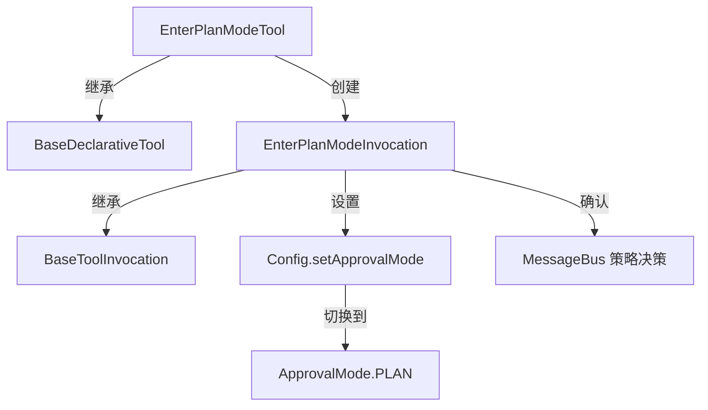

# enter-plan-mode.ts

> 将 Agent 切换到计划模式，限制为只读操作以确保安全规划

## 概述

`enter-plan-mode.ts` 实现了 `EnterPlanMode` 工具，允许 AI Agent 主动进入计划模式（Plan Mode）。在计划模式下，Agent 被限制为只读工具，不能执行写入操作，从而在制定实施方案时确保不会意外修改文件。该工具属于 `Kind.Plan` 类别，是计划/审批工作流的入口。

设计动机：在处理复杂任务时，先让 Agent 制定计划再执行是一种更安全的模式。该工具为这种工作流提供了标准化的入口。

## 架构图

## 主要导出

### `interface EnterPlanModeParams`
- **签名**: `{ reason?: string }`
- **用途**: 进入计划模式的参数，`reason` 为可选的切换原因说明。

### `class EnterPlanModeTool`
- **签名**: `class EnterPlanModeTool extends BaseDeclarativeTool<EnterPlanModeParams, ToolResult>`
- **用途**: 计划模式入口工具的声明式工具类。

### `class EnterPlanModeInvocation`
- **签名**: `class EnterPlanModeInvocation extends BaseToolInvocation<EnterPlanModeParams, ToolResult>`
- **用途**: 计划模式入口的调用实例。

## 核心逻辑

1. **策略决策**: `shouldConfirmExecute()` 首先通过 `getMessageBusDecision()` 查询策略：
   - `ALLOW`: 直接执行，不需确认。
   - `DENY`: 抛出错误，拒绝执行。
   - `ASK_USER`: 显示确认提示，告知用户 Agent 将被限制为只读工具。
2. **用户取消**: 若用户取消确认，返回 "User cancelled" 信息。
3. **模式切换**: 调用 `config.setApprovalMode(ApprovalMode.PLAN)` 将审批模式设置为 PLAN。
4. **结果反馈**: 向 LLM 返回 "Switching to Plan mode"，并在 `returnDisplay` 中附加切换原因（如果有）。

## 内部依赖

| 模块 | 用途 |
|------|------|
| `./tools` | 基类及类型定义 |
| `../confirmation-bus/message-bus` | 消息总线 |
| `../config/config` | 运行时配置 |
| `./tool-names` | `ENTER_PLAN_MODE_TOOL_NAME` |
| `../policy/types` | `ApprovalMode` |
| `./definitions/coreTools` | `ENTER_PLAN_MODE_DEFINITION` |
| `./definitions/resolver` | `resolveToolDeclaration` |

## 外部依赖

无外部第三方依赖。
