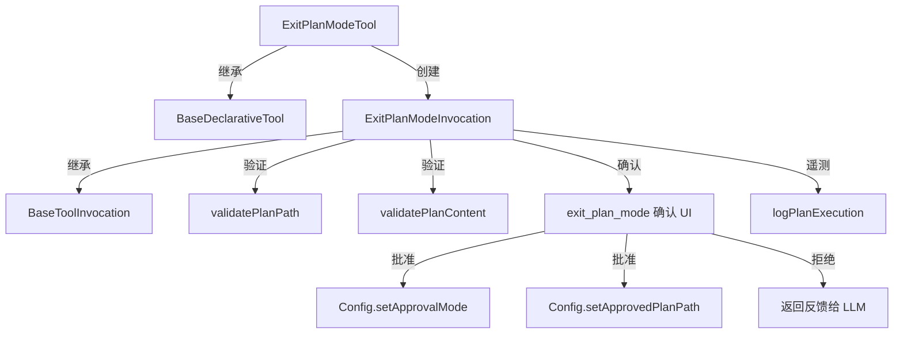

# exit-plan-mode.ts

> 退出计划模式并提交计划供用户审批，恢复 Agent 的写入能力

## 概述

`exit-plan-mode.ts` 实现了 `ExitPlanMode` 工具，是计划/审批工作流的出口。Agent 在计划模式下撰写实施方案并保存为文件后，通过此工具提交计划供用户审批。用户可以批准（选择不同的审批模式）、拒绝并提供反馈、或直接取消。批准后 Agent 恢复写入能力，并被要求严格按照已批准的计划执行。

设计动机：确保用户在 Agent 执行破坏性操作前有机会审核和批准计划，同时支持多种后续审批模式（DEFAULT、AUTO_EDIT 等）。

## 架构图

## 主要导出

### `interface ExitPlanModeParams`
- **签名**: `{ plan_path: string }`
- **用途**: 退出计划模式的参数，`plan_path` 为计划文件的路径。

### `class ExitPlanModeTool`
- **签名**: `class ExitPlanModeTool extends BaseDeclarativeTool<ExitPlanModeParams, ToolResult>`
- **用途**: 计划模式出口工具的声明式工具类。
- **关键方法**:
  - `validateToolParamValues(params)`: 验证 `plan_path` 非空，且解析后的路径位于指定的 plans 目录内（防止路径遍历攻击）。

### `class ExitPlanModeInvocation`
- **签名**: `class ExitPlanModeInvocation extends BaseToolInvocation<ExitPlanModeParams, ToolResult>`
- **用途**: 退出计划模式的调用实例。

## 核心逻辑

1. **路径安全验证**:
   - 同步验证（`validateToolParamValues`）：使用 `resolveToRealPath` 和 `isSubpath` 确保计划路径在 plans 目录内。
   - 异步验证（`shouldConfirmExecute`）：调用 `validatePlanPath` 和 `validatePlanContent` 进行更详细的路径和内容验证。
2. **策略决策**:
   - `DENY`: 抛出错误。
   - `ALLOW`: 自动批准，设置默认审批模式 (`ApprovalMode.DEFAULT`)。
   - `ASK_USER`: 展示 `exit_plan_mode` 类型的确认界面，包含计划文件路径。
3. **用户响应处理**:
   - **批准**: 从 payload 中获取用户选择的 `approvalMode`（不允许 PLAN 或 YOLO），切换审批模式，设置已批准的计划路径，记录遥测，返回退出消息并指示 LLM 严格按计划执行。
   - **拒绝并带反馈**: 返回反馈内容，要求 LLM 修改计划。
   - **拒绝无反馈**: 要求 LLM 主动询问用户改进意见。
   - **取消**: 返回取消信息，Agent 仍停留在计划模式。

## 内部依赖

| 模块 | 用途 |
|------|------|
| `./tools` | 基类及确认相关类型 |
| `../confirmation-bus/message-bus` | 消息总线 |
| `../config/config` | 运行时配置 |
| `./tool-names` | `EXIT_PLAN_MODE_TOOL_NAME` |
| `../utils/planUtils` | `validatePlanPath`、`validatePlanContent` |
| `../policy/types` | `ApprovalMode` |
| `../utils/paths` | `resolveToRealPath`、`isSubpath` |
| `../telemetry/loggers` | `logPlanExecution` |
| `../telemetry/types` | `PlanExecutionEvent` |
| `./definitions/coreTools` | `getExitPlanModeDefinition` |
| `./definitions/resolver` | `resolveToolDeclaration` |
| `../utils/approvalModeUtils` | `getPlanModeExitMessage` |

## 外部依赖

| 包 | 用途 |
|----|------|
| `node:path` | 路径解析和拼接 |
