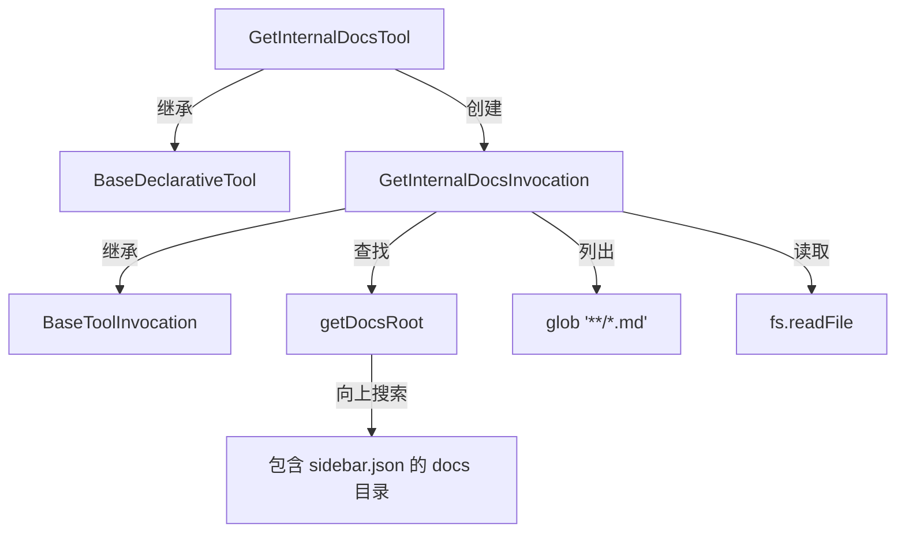

# get-internal-docs.ts

> 访问 Gemini CLI 内置文档的工具，支持列出和读取文档文件

## 概述

`get-internal-docs.ts` 实现了 `GetInternalDocs` 工具，为 AI Agent 提供对 Gemini CLI 内部文档的访问能力。该工具有两种操作模式：不传 `path` 参数时列出所有可用的 `.md` 文档文件；传入 `path` 时读取指定文档的内容。该工具属于 `Kind.Think` 类别，不需要用户确认即可执行。

设计动机：让 Agent 能自主查阅 CLI 的官方文档来回答用户关于 Gemini CLI 功能的问题，减少幻觉回答。

## 架构图

## 主要导出

### `interface GetInternalDocsParams`
- **签名**: `{ path?: string }`
- **用途**: 工具参数。`path` 为可选的文档文件相对路径（如 `'cli/commands.md'`），省略时列出所有文档。

### `class GetInternalDocsTool`
- **签名**: `class GetInternalDocsTool extends BaseDeclarativeTool<GetInternalDocsParams, ToolResult>`
- **用途**: 内部文档访问工具的声明式工具类。构造时标记 `isOutputMarkdown: true`。

## 核心逻辑

1. **文档根目录发现** (`getDocsRoot`): 从当前文件目录开始向上搜索，寻找包含 `sidebar.json` 标记文件的 `docs` 子目录。若到达文件系统根目录仍未找到，抛出错误。
2. **列出文档**: 使用 `glob('**/*.md')` 递归列出所有 Markdown 文件，排序后以列表形式返回。
3. **读取文档**: 将请求路径解析为绝对路径，**安全检查**确保解析后的路径仍在 `docsRoot` 内（防止路径遍历攻击），然后读取文件内容返回。
4. **无需确认**: `shouldConfirmExecute()` 始终返回 `false`，因为读取内置文档是无副作用的安全操作。
5. **错误处理**: 所有异常被统一捕获，返回包含错误信息的 `ToolResult`，错误类型为 `EXECUTION_FAILED`。

## 内部依赖

| 模块 | 用途 |
|------|------|
| `./tools` | 基类及类型定义 |
| `./tool-names` | `GET_INTERNAL_DOCS_TOOL_NAME` |
| `./tool-error` | `ToolErrorType` |
| `../confirmation-bus/message-bus` | 消息总线 |
| `./definitions/coreTools` | `GET_INTERNAL_DOCS_DEFINITION` |
| `./definitions/resolver` | `resolveToolDeclaration` |

## 外部依赖

| 包 | 用途 |
|----|------|
| `glob` | 文件模式匹配，列出所有 `.md` 文件 |
| `node:fs/promises` | 异步文件读取和目录检查 |
| `node:path` | 路径处理 |
| `node:url` | `fileURLToPath` 将 `import.meta.url` 转为文件路径 |
