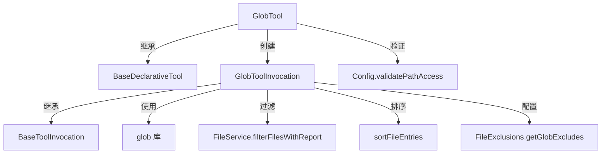

# glob.ts

> 基于 glob 模式的文件搜索工具，支持多工作区目录和智能排序

## 概述

`glob.ts` 实现了 `Glob` 工具，允许 AI Agent 使用 glob 模式（如 `**/*.ts`、`src/**/*.test.js`）在工作区中搜索文件。搜索结果按修改时间排序（最近修改的文件优先），支持大小写敏感控制、`.gitignore` 和 `.geminiignore` 过滤。该工具属于 `Kind.Search` 类别，是文件发现的主要手段。

设计动机：Agent 需要在项目中定位文件以理解代码结构。与 `grep` 按内容搜索不同，`glob` 按文件名模式搜索，适用于 "找到所有测试文件" 等场景。智能排序确保最近修改的文件（通常与当前任务最相关）排在前面。

## 架构图

## 主要导出

### `interface GlobPath`
- **签名**: `{ fullpath(): string; mtimeMs?: number }`
- **用途**: glob 库 `Path` 接口的子集，便于测试 mock。

### `function sortFileEntries(entries, nowTimestamp, recencyThresholdMs)`
- **签名**: `(entries: GlobPath[], nowTimestamp: number, recencyThresholdMs: number) => GlobPath[]`
- **用途**: 文件排序函数。在 `recencyThresholdMs`（默认 24 小时）内修改的文件按时间倒序排列在前，其余文件按路径字母序排列在后。

### `interface GlobToolParams`
- **签名**: `{ pattern: string, dir_path?: string, case_sensitive?: boolean, respect_git_ignore?: boolean, respect_gemini_ignore?: boolean }`
- **用途**: 工具参数定义。

### `class GlobTool`
- **签名**: `class GlobTool extends BaseDeclarativeTool<GlobToolParams, ToolResult>`
- **用途**: Glob 文件搜索工具的声明式工具类。

## 核心逻辑

1. **搜索范围确定**: 若指定 `dir_path`，验证路径合法性后限定搜索范围；否则搜索所有工作区目录。
2. **模式处理**: 如果 `pattern` 对应的完整路径是一个已存在的文件，使用 `escape()` 转义 pattern 以防止被 glob 展开（处理文件名包含通配符的边界情况）。
3. **文件搜索**: 使用 `glob` 库执行搜索，配置项包括：`nodir`（排除目录）、`stat`（获取修改时间）、`nocase`（大小写不敏感，默认）、`dot`（包含隐藏文件）、`ignore`（排除模式）、`follow: false`（不跟随符号链接）。
4. **过滤**: 通过 `FileService.filterFilesWithReport` 应用 `.gitignore` 和 `.geminiignore` 规则，记录被忽略的文件数量。
5. **排序与输出**: 使用 `sortFileEntries` 按新鲜度和字母序排序，返回绝对路径列表。
6. **策略更新**: `getPolicyUpdateOptions` 基于搜索模式生成策略更新选项，用于自动审批相似操作。

## 内部依赖

| 模块 | 用途 |
|------|------|
| `./tools` | 基类及类型定义 |
| `../utils/paths` | `shortenPath`、`makeRelative` |
| `../config/config` | 运行时配置 |
| `../config/constants` | `DEFAULT_FILE_FILTERING_OPTIONS` |
| `./tool-error` | `ToolErrorType` |
| `./tool-names` | `GLOB_TOOL_NAME`、`GLOB_DISPLAY_NAME` |
| `../policy/utils` | `buildPatternArgsPattern` |
| `../utils/errors` | `getErrorMessage` |
| `../utils/debugLogger` | 调试日志 |
| `./definitions/coreTools` | `GLOB_DEFINITION` |
| `./definitions/resolver` | `resolveToolDeclaration` |
| `../confirmation-bus/message-bus` | 消息总线 |

## 外部依赖

| 包 | 用途 |
|----|------|
| `glob` | 核心 glob 模式匹配引擎，提供 `glob` 和 `escape` 函数 |
| `node:fs` | 同步文件存在性检查 (`existsSync`) |
| `node:path` | 路径处理 |
