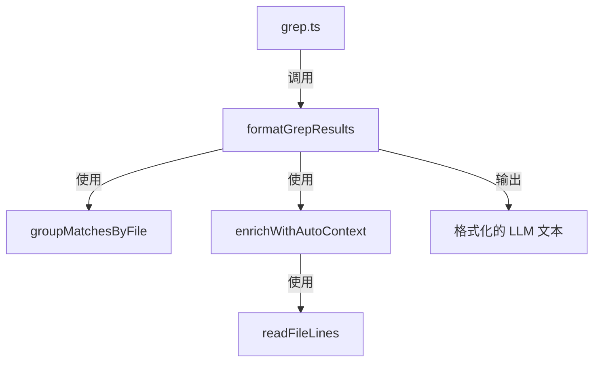

# grep-utils.ts

> Grep 搜索结果的分组、上下文增强和格式化工具函数集

## 概述

`grep-utils.ts` 提供 grep 搜索结果的后处理功能，包括按文件分组、自动上下文增强、结果格式化。它是 `grep.ts` 的辅助模块，将搜索结果从原始匹配数据转换为对 LLM 友好的格式化文本。

其中最重要的优化是 **自动上下文增强**（auto-context）：当匹配数较少（1-3 个）时，自动附加匹配行周围的上下文行，使 Agent 无需额外调用 `read_file` 来查看匹配的上下文，从而减少约 10% 的交互轮次（据 SWEBench 测试数据）。

## 架构图

## 主要导出

### `interface GrepMatch`
- **签名**: `{ filePath: string, absolutePath: string, lineNumber: number, line: string, isContext?: boolean }`
- **用途**: 单个 grep 匹配结果。`isContext` 标记该行是否为自动添加的上下文行（非直接匹配）。

### `function groupMatchesByFile(allMatches)`
- **签名**: `(allMatches: GrepMatch[]) => Record<string, GrepMatch[]>`
- **用途**: 将匹配结果按文件路径分组，每组内按行号排序。

### `function readFileLines(absolutePath)`
- **签名**: `(absolutePath: string) => Promise<string[] | null>`
- **用途**: 读取文件内容并按行分割。读取失败时返回 `null`（不中断流程）。

### `function enrichWithAutoContext(matchesByFile, matchCount, params)`
- **签名**: `(matchesByFile: Record<string, GrepMatch[]>, matchCount: number, params: {...}) => Promise<void>`
- **用途**: 原地修改 `matchesByFile`，为低匹配数的结果自动添加上下文行。

### `function formatGrepResults(allMatches, params, searchLocationDescription, totalMaxMatches)`
- **签名**: `(allMatches: GrepMatch[], params: {...}, searchLocationDescription: string, totalMaxMatches: number) => Promise<{llmContent: string, returnDisplay: string}>`
- **用途**: 将匹配结果格式化为最终输出，包括文件分组、上下文增强、截断标记。

## 核心逻辑

### 自动上下文增强 (`enrichWithAutoContext`)

触发条件：
- 匹配数在 1-3 之间
- 未指定 `names_only`
- 未手动指定 `context`、`before`、`after` 参数

上下文行数：
- 1 个匹配：前后各 50 行
- 2-3 个匹配：前后各 15 行

实现方式：读取文件内容，围绕每个匹配行扩展上下文范围，使用 `seenLines` Set 去重，将上下文行标记为 `isContext: true`。

### 结果格式化 (`formatGrepResults`)

1. **无匹配**: 返回 "No matches found" 消息。
2. **names_only 模式**: 只返回去重排序后的文件路径列表。
3. **标准模式**: 按文件分组输出，每个匹配行格式为 `L{行号}: {内容}`，上下文行使用 `-` 分隔符 (`L{行号}- {内容}`)。
4. **行截断**: 超过 `MAX_LINE_LENGTH_TEXT_FILE` 的行会被截断并附加 `... [truncated]`。
5. **结果限制**: 达到 `totalMaxMatches` 时标记 "(results limited to N matches for performance)"。

## 内部依赖

| 模块 | 用途 |
|------|------|
| `../utils/debugLogger` | 文件读取失败时的警告日志 |
| `../utils/constants` | `MAX_LINE_LENGTH_TEXT_FILE` 行长度限制 |

## 外部依赖

| 包 | 用途 |
|----|------|
| `node:fs/promises` | 异步文件读取 |
