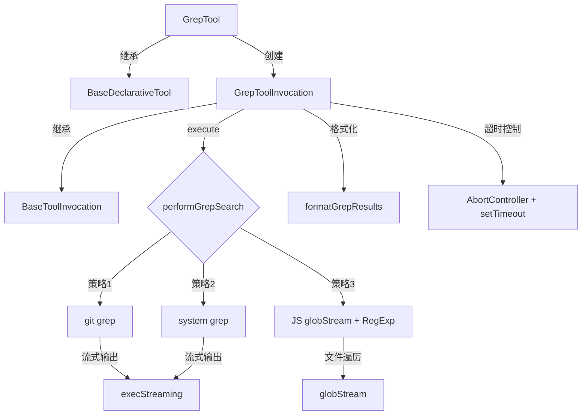

# grep.ts

> 基于正则表达式的文件内容搜索工具，采用三级策略：git grep -> system grep -> JS 回退

## 概述

`grep.ts` 实现了 `Grep` 工具（显示名称为 `SearchText`），允许 AI Agent 在工作区文件中搜索匹配正则表达式的内容。该工具采用分层搜索策略以兼顾性能和兼容性：优先使用 `git grep`（最快），回退到系统 `grep`，最后使用纯 JavaScript 实现。支持文件类型过滤、排除模式、每文件/总匹配数限制，以及多工作区目录搜索。属于 `Kind.Search` 类别。

设计动机：内容搜索是代码理解和导航的核心能力。`git grep` 利用 Git 索引极为高效，但并非所有项目都是 Git 仓库。分层策略确保工具在各种环境下都能工作。

## 架构图

## 主要导出

### `interface GrepToolParams`
- **签名**: `{ pattern: string, dir_path?: string, include_pattern?: string, exclude_pattern?: string, names_only?: boolean, max_matches_per_file?: number, total_max_matches?: number }`
- **用途**: 搜索参数定义。`pattern` 为正则表达式；`include_pattern` 筛选文件类型；`exclude_pattern` 排除匹配行；`names_only` 只返回文件名。

### `class GrepTool`
- **签名**: `class GrepTool extends BaseDeclarativeTool<GrepToolParams, ToolResult>`
- **用途**: Grep 搜索工具的声明式工具类。

## 核心逻辑

### 三级搜索策略

1. **git grep** (策略 1):
   - 前置条件：目录是 Git 仓库且 `git` 命令可用。
   - 参数：`--untracked`（包含未跟踪文件）、`-n`（行号）、`-E`（扩展正则）、`--ignore-case`。
   - 通过 `execStreaming` 流式读取输出，逐行解析。
   - 失败时静默回退到下一策略。

2. **system grep** (策略 2):
   - 前置条件：`grep` 命令可用。
   - 参数：`-r`（递归）、`-n`（行号）、`-H`（显示文件名）、`-E`（扩展正则）、`-I`（跳过二进制文件）。
   - 自动从 `FileExclusions` 提取目录排除模式（`--exclude-dir`）。
   - 权限错误被静默处理。

3. **JavaScript 回退** (策略 3):
   - 使用 `globStream` 遍历匹配文件，逐文件读取并用 `RegExp` 逐行匹配。
   - 路径安全检查：确保文件不超出搜索目录范围。
   - 读取错误（如权限被拒）被跳过。

### 超时与中止控制

- 使用 `DEFAULT_SEARCH_TIMEOUT_MS` (30s) 创建超时 `AbortController`。
- 将外部传入的 `signal` 链接到超时控制器，任一触发都会中止搜索。
- `finally` 块中清理定时器和事件监听器。

### 输出解析

`parseGrepLine` 使用正则 `/^(.+?):(\d+):(.*)$/` 解析 `文件路径:行号:内容` 格式。包含安全检查：拒绝指向搜索目录之外的路径。

### 多工作区支持

未指定 `dir_path` 时搜索所有工作区目录，多目录结果中为文件路径添加目录名前缀以避免歧义。

### 命令可用性检查

`isCommandAvailable` 通过 `command -v`（Unix）或 `where`（Windows）检查命令是否存在，支持沙盒环境。

## 内部依赖

| 模块 | 用途 |
|------|------|
| `./tools` | 基类及类型定义 |
| `./constants` | `DEFAULT_TOTAL_MAX_MATCHES`、`DEFAULT_SEARCH_TIMEOUT_MS` |
| `./grep-utils` | `GrepMatch` 类型、`formatGrepResults` |
| `./tool-names` | `GREP_TOOL_NAME` |
| `./tool-error` | `ToolErrorType` |
| `../utils/paths` | `makeRelative`、`shortenPath` |
| `../utils/errors` | `getErrorMessage`、`isNodeError` |
| `../utils/gitUtils` | `isGitRepository` |
| `../utils/shell-utils` | `execStreaming` |
| `../utils/debugLogger` | 调试日志 |
| `../utils/ignorePatterns` | `FileExclusions` 类型 |
| `../config/config` | 运行时配置 |
| `../policy/utils` | `buildPatternArgsPattern` |
| `./definitions/coreTools` | `GREP_DEFINITION` |
| `./definitions/resolver` | `resolveToolDeclaration` |
| `../confirmation-bus/message-bus` | 消息总线 |

## 外部依赖

| 包 | 用途 |
|----|------|
| `glob` | `globStream` 用于 JS 回退策略的文件遍历 |
| `node:fs` | 同步文件状态检查 |
| `node:fs/promises` | 异步文件读取和状态检查 |
| `node:path` | 路径处理 |
| `node:child_process` | `spawn` 用于命令可用性检查 |
