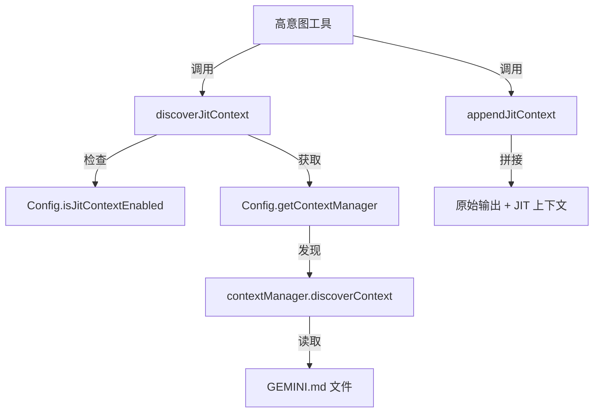

# jit-context.ts

> 即时上下文发现：在工具访问文件/目录时动态加载 GEMINI.md 上下文文件

## 概述

`jit-context.ts` 实现了 JIT（Just-In-Time）上下文发现机制。当 "高意图" 工具（如 `read_file`、`list_directory`、`write_file`、`replace`、`read_many_files`）访问某个路径时，该模块会检查该路径所在的子目录中是否存在 `GEMINI.md` 上下文文件，并将其内容动态加载到工具输出中。这使得项目可以在不同目录下放置特定的上下文指令，Agent 在访问该目录时自动获取这些上下文。

设计动机：大型项目中不同子目录可能有不同的编码规范、架构约束或注意事项。JIT 上下文允许这些信息在 Agent 需要时才加载，避免一次性将所有信息塞入系统提示。

## 架构图

## 主要导出

### `function discoverJitContext(config, accessedPath)`
- **签名**: `(config: Config, accessedPath: string) => Promise<string>`
- **用途**: 发现给定路径的 JIT 上下文。如果 JIT 未启用或无上下文管理器，返回空字符串。异常被静默吞掉（JIT 上下文是辅助性的，不应影响工具的主操作）。

### `const JIT_CONTEXT_PREFIX`
- **签名**: `'\n\n--- Newly Discovered Project Context ---\n'`
- **用途**: JIT 上下文的开始分隔符。

### `const JIT_CONTEXT_SUFFIX`
- **签名**: `'\n--- End Project Context ---'`
- **用途**: JIT 上下文的结束分隔符。

### `function appendJitContext(llmContent, jitContext)`
- **签名**: `(llmContent: string, jitContext: string) => string`
- **用途**: 将 JIT 上下文附加到工具输出内容后面。若 `jitContext` 为空则返回原内容不变。

## 核心逻辑

1. **功能开关检查**: 调用 `config.isJitContextEnabled?.()` 检查 JIT 上下文功能是否启用。
2. **上下文管理器获取**: 通过 `config.getContextManager()` 获取上下文管理器实例。
3. **可信根目录**: 从工作区上下文获取所有工作目录作为可信根目录列表。
4. **上下文发现**: 调用 `contextManager.discoverContext(accessedPath, trustedRoots)` 执行实际的上下文发现。
5. **容错设计**: 整个发现过程被 try-catch 包裹，任何异常都被静默处理，确保不影响工具主操作。
6. **格式化拼接**: `appendJitContext` 使用明确的分隔标记将上下文附加到工具输出末尾，帮助 LLM 区分工具输出和项目上下文。

## 内部依赖

| 模块 | 用途 |
|------|------|
| `../config/config` | `Config` 类型，获取 JIT 配置和上下文管理器 |

## 外部依赖

无外部第三方依赖。
