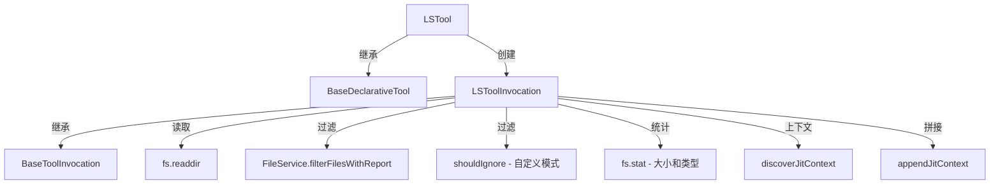

# ls.ts

> 目录列表工具，列出指定目录的文件和子目录并支持 JIT 上下文发现

## 概述

`ls.ts` 实现了 `LS` 工具（显示名称为 `ReadFolder`），允许 AI Agent 列出指定目录的内容。输出按 "目录优先，然后字母排序" 排列，包含文件大小信息。支持 `.gitignore` / `.geminiignore` 过滤、自定义忽略模式，以及 JIT 上下文自动发现。该工具属于 `Kind.Search` 类别。

设计动机：目录浏览是代码探索的基础能力，Agent 通过列出目录内容来了解项目结构，决定下一步要读取或搜索哪些文件。

## 架构图

## 主要导出

### `interface LSToolParams`
- **签名**: `{ dir_path: string, ignore?: string[], file_filtering_options?: { respect_git_ignore?: boolean, respect_gemini_ignore?: boolean } }`
- **用途**: 工具参数。`dir_path` 为目标目录路径；`ignore` 为自定义的 glob 排除模式列表。

### `interface FileEntry`
- **签名**: `{ name: string, path: string, isDirectory: boolean, size: number, modifiedTime: Date }`
- **用途**: 目录中单个条目的信息。

### `class LSTool`
- **签名**: `class LSTool extends BaseDeclarativeTool<LSToolParams, ToolResult>`
- **用途**: 目录列表工具的声明式工具类。

## 核心逻辑

1. **路径验证**: 解析 `dir_path` 为绝对路径，通过 `validatePathAccess` 检查是否在工作区内。验证路径存在且为目录。
2. **读取目录**: 使用 `fs.readdir` 获取目录条目列表。
3. **三层过滤**:
   - **文件服务过滤**: 通过 `FileService.filterFilesWithReport` 应用 `.gitignore` 和 `.geminiignore` 规则，记录被忽略的文件数。
   - **自定义忽略模式**: `shouldIgnore` 方法将用户传入的 glob pattern 转为正则表达式匹配文件名。
   - **错误容忍**: 单个文件的 `stat` 失败不会中断整个列表操作。
4. **排序**: 目录排在文件前面，同类型按名称字母序排列。
5. **格式化输出**: 目录标记为 `[DIR] name`，文件显示为 `name (size bytes)`。
6. **JIT 上下文**: 调用 `discoverJitContext` 发现并附加目录的上下文文件内容。
7. **策略更新**: `getPolicyUpdateOptions` 基于 `dir_path` 生成策略更新选项。

## 内部依赖

| 模块 | 用途 |
|------|------|
| `./tools` | 基类及类型定义 |
| `./tool-names` | `LS_TOOL_NAME` |
| `./tool-error` | `ToolErrorType` |
| `./jit-context` | `discoverJitContext`、`appendJitContext` |
| `../utils/paths` | `makeRelative`、`shortenPath` |
| `../config/config` | 运行时配置 |
| `../config/constants` | `DEFAULT_FILE_FILTERING_OPTIONS` |
| `../policy/utils` | `buildDirPathArgsPattern` |
| `../utils/debugLogger` | 调试日志 |
| `./definitions/coreTools` | `LS_DEFINITION` |
| `./definitions/resolver` | `resolveToolDeclaration` |
| `../confirmation-bus/message-bus` | 消息总线 |

## 外部依赖

| 包 | 用途 |
|----|------|
| `node:fs/promises` | 异步目录读取和文件状态查询 |
| `node:path` | 路径处理 |
