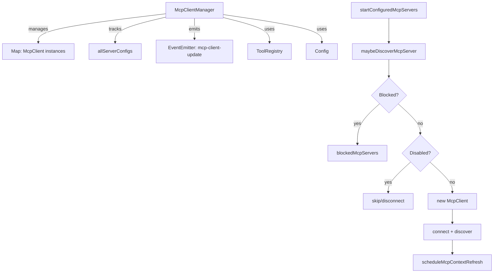

# mcp-client-manager.ts

> 多 MCP 客户端的统一生命周期管理器，负责启动、停止、重启和扩展加载。

## 概述
`McpClientManager` 是管理多个 `McpClient` 实例的中心类。它协调所有已配置的 MCP 服务器（包括设置文件中的和命令行指定的）的连接、发现、断开流程，同时支持扩展（Extension）的动态加载和卸载。该类还负责诊断信息的去重显示、MCP 上下文刷新调度（采用 Coalescing Pattern 防止频繁刷新），以及服务器启用/禁用的管理。

## 架构图

## 主要导出

### `class McpClientManager`
- **构造函数**: `(clientVersion, toolRegistry, cliConfig, eventEmitter?)`
- `startConfiguredMcpServers()`: 启动所有配置中的 MCP 服务器
- `startExtension(extension)`: 加载扩展的 MCP 服务器
- `stopExtension(extension)`: 卸载扩展的 MCP 服务器
- `restart()`: 重启所有服务器
- `restartServer(name)`: 重启单个服务器
- `stop()`: 停止所有客户端
- `getClient(serverName)`: 获取指定名称的客户端
- `getDiscoveryState()`: 获取发现状态
- `getMcpServers()`: 获取所有服务器配置（含禁用的）
- `getMcpInstructions()`: 汇总所有服务器的指令
- `getMcpServerCount()`: 获取活跃客户端数量
- `emitDiagnostic(...)`: 发送诊断信息，含去重和静默模式

## 核心逻辑
1. **服务器启用检查三层过滤**：管理员设置（允许/阻止列表） -> 用户设置（会话/文件级禁用） -> 信任文件夹检查
2. **Discovery Promise 链式调度**：多个服务器发现任务串行链接，保证上一个完成后下一个开始
3. **诊断消息智能显示**：用户未交互时仅显示提示（"MCP issues detected. Run /mcp list for status."），交互后显示详细信息，同时做去重处理
4. **MCP 上下文刷新合并**：通过 `scheduleMcpContextRefresh` 方法，采用 Coalescing Pattern 和 300ms 延迟，合并密集的刷新请求

## 内部依赖
- `./mcp-client.ts` - `McpClient`, `MCPDiscoveryState`, `populateMcpServerCommand`
- `./tool-registry.ts` - `ToolRegistry`
- `../config/config.ts` - `Config`, `MCPServerConfig`, `GeminiCLIExtension`
- `../utils/errors.ts` - 错误处理工具
- `../utils/events.ts` - `coreEvents`
- `../utils/debugLogger.ts` - 调试日志

## 外部依赖
- `node:events` - EventEmitter
