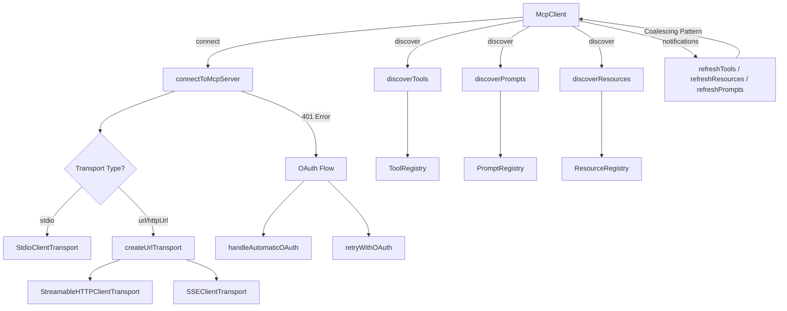

# mcp-client.ts

> MCP (Model Context Protocol) 服务器客户端：负责连接、发现工具/提示/资源，以及 OAuth 认证流程的完整管理。

## 概述
本文件是 Gemini CLI 与外部 MCP 服务器交互的核心模块，约 2300 行代码。它封装了与单个 MCP 服务器的完整生命周期管理，包括：连接建立（支持 Stdio / SSE / Streamable HTTP 三种传输方式）、工具/提示/资源的发现与注册、OAuth 自动认证与重试机制，以及动态通知处理（工具列表变更、资源变更等）。该文件同时维护了全局的服务器状态跟踪和事件监听系统。

## 架构图

## 主要导出

### `class McpClient`
- 单个 MCP 服务器的客户端封装，实现 `McpProgressReporter` 接口
- `connect()`: 连接到 MCP 服务器
- `discover(cliConfig)`: 发现并注册工具、提示、资源
- `disconnect()`: 断开连接并清理注册
- `getStatus()`: 返回当前连接状态
- `readResource(uri)`: 读取指定资源
- `registerProgressToken / unregisterProgressToken`: 进度 token 管理

### `enum MCPServerStatus`
服务器状态枚举：`DISCONNECTED | DISCONNECTING | CONNECTING | CONNECTED | BLOCKED | DISABLED`

### `enum MCPDiscoveryState`
发现过程状态：`NOT_STARTED | IN_PROGRESS | COMPLETED`

### `interface McpContext`
MCP 操作所需的配置与诊断报告接口，由 `Config` 类实现。

### `interface McpProgressReporter`
MCP 工具调用的进度报告接口。

### 全局状态管理函数
- `addMCPStatusChangeListener / removeMCPStatusChangeListener`: 监听/取消服务器状态变更
- `updateMCPServerStatus / getMCPServerStatus / getAllMCPServerStatuses`: 状态读写
- `getMCPDiscoveryState`: 获取全局发现状态

### 核心流程函数
- `discoverMcpTools(...)`: 从所有配置的 MCP 服务器发现工具（已废弃，由 McpClientManager 替代）
- `connectAndDiscover(...)`: 连接并发现单个服务器的工具
- `connectToMcpServer(...)`: 创建并连接 MCP 客户端，含 OAuth 自动处理
- `createTransport(...)`: 根据配置创建对应传输层
- `discoverTools / discoverPrompts / discoverResources`: 发现各类资源
- `invokeMcpPrompt(...)`: 调用 MCP 服务器上的 prompt
- `populateMcpServerCommand(...)`: 将命令行参数转换为服务器配置
- `isEnabled(...)`: 判断工具是否被 include/exclude 过滤
- `hasNetworkTransport(...)`: 判断是否为网络传输类型

## 核心逻辑
1. **传输层自动选择**：优先使用 `httpUrl`（已废弃），其次按 `type` 字段选择 HTTP 或 SSE，无 `type` 时默认 HTTP，失败后自动回退 SSE。
2. **OAuth 自动发现与认证**：遇到 401 错误时，从 `www-authenticate` 头或服务器基础 URL 自动发现 OAuth 配置，完成认证后重试连接。
3. **通知处理与合并刷新**：采用 Coalescing Pattern 处理服务器发送的工具/资源/提示变更通知，防止并发刷新导致的竞态条件。含验证重试机制（500ms 延迟后再查一次）。
4. **Xcode mcpbridge 修复**：对 Xcode 26.3 的 `xcrun mcpbridge` 命令自动包装 `XcodeMcpBridgeFixTransport`。
5. **宽容 JSON Schema 验证**：`LenientJsonSchemaValidator` 在 AJV 编译失败时回退到无验证模式，确保工具发现不因 schema 问题中断。

## 内部依赖
- `./mcp-tool.ts` - `DiscoveredMCPTool` 类
- `./xcode-mcp-fix-transport.ts` - Xcode 修复传输层
- `./tool-registry.ts` - 工具注册表
- `../config/config.ts` - 配置接口
- `../mcp/oauth-provider.ts`, `../mcp/oauth-token-storage.ts`, `../mcp/oauth-utils.ts` - OAuth 相关
- `../mcp/google-auth-provider.ts`, `../mcp/sa-impersonation-provider.ts` - Google 认证提供者
- `../policy/toml-loader.ts` - 策略验证
- `../services/environmentSanitization.ts` - 环境变量清理
- `../utils/envExpansion.ts` - 环境变量展开
- `../resources/resource-registry.ts` - 资源注册表
- `../prompts/prompt-registry.ts` - 提示注册表

## 外部依赖
- `@modelcontextprotocol/sdk` - MCP SDK（Client, Transport, Schema 等）
- `shell-quote` - Shell 命令解析
