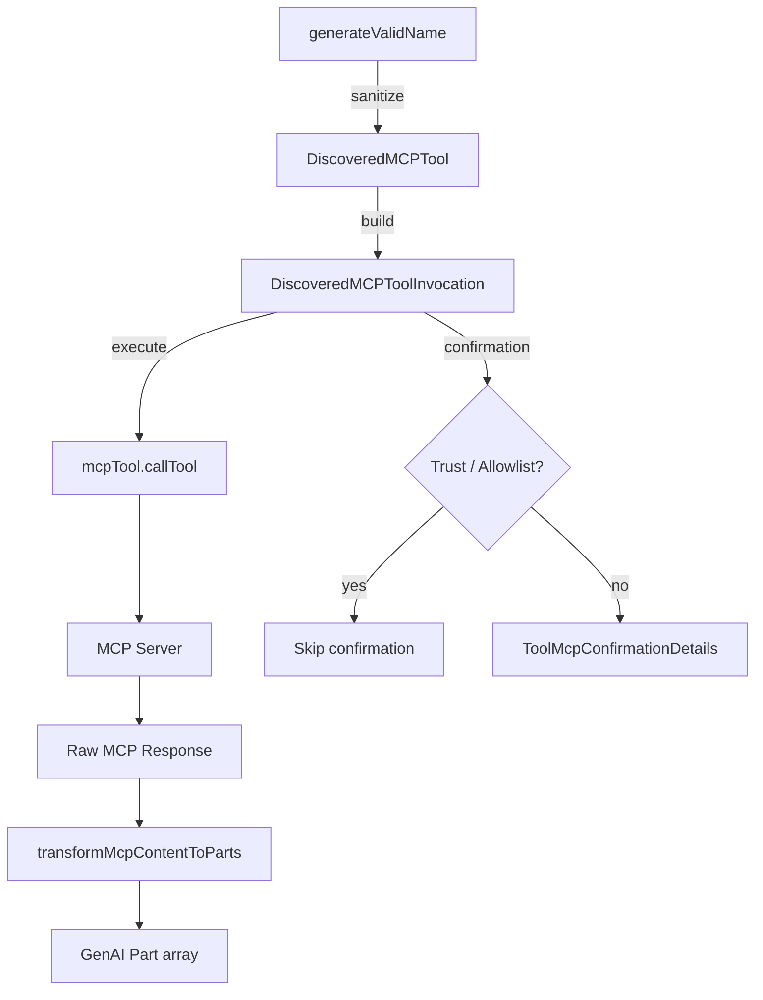

# mcp-tool.ts

> MCP 工具的声明式封装与调用执行，将 MCP 协议工具适配为 Gemini CLI 内部工具体系。

## 概述
本文件将外部 MCP 服务器发现的工具包装为 Gemini CLI 的 `BaseDeclarativeTool` 子类，实现统一的工具验证、确认、执行流程。核心包含两个类：`DiscoveredMCPTool`（工具定义/构建器）和 `DiscoveredMCPToolInvocation`（单次调用执行器）。同时提供工具名称的合规化（生成符合 Gemini API 64 字符限制的名称）、MCP 内容块到 GenAI Part 的转换，以及 MCP 工具确认机制（支持服务器级和工具级白名单）。

## 架构图

## 主要导出

### 常量
- `MCP_QUALIFIED_NAME_SEPARATOR = '_'` - MCP 工具名限定分隔符
- `MCP_TOOL_PREFIX = 'mcp_'` - MCP 工具名强制前缀

### 函数
- `isMcpToolName(name)`: 判断是否为 MCP 工具名
- `parseMcpToolName(name)`: 从全限定名提取 serverName 和 toolName
- `formatMcpToolName(serverName, toolName?)`: 组装全限定名，支持通配符
- `isMcpToolAnnotation(annotation)`: MCP 工具注解类型守卫
- `generateValidName(name)`: 生成符合 Gemini API 要求的工具名（64 字符限制，非法字符替换）

### 类
- `DiscoveredMCPTool extends BaseDeclarativeTool` - MCP 工具定义，含 serverName、trust 标记、readOnly 标记
- `DiscoveredMCPToolInvocation extends BaseToolInvocation` - MCP 工具调用执行器，含 abort 信号、MCP 错误检测、内容转换

### 接口/类型
- `McpToolAnnotation` - MCP 工具注解接口

## 核心逻辑
1. **名称生成规则**：`mcp_{serverName}_{toolName}`，非法字符替换为下划线，超过 63 字符时中间截断为 `...`
2. **确认机制**：检查 trust 标记和静态 allowlist（支持 server 级和 tool 级），白名单命中则跳过确认
3. **MCP 内容转换**：支持 text / image / audio / resource / resource_link 五种 MCP 内容块到 GenAI Part 的映射
4. **错误检测**：检查 MCP 响应中的 `isError` 字段（兼容顶层和嵌套 error 对象）

## 内部依赖
- `./tools.ts` - `BaseDeclarativeTool`, `BaseToolInvocation`, `Kind`, `ToolConfirmationOutcome` 等
- `./tool-error.ts` - `ToolErrorType`
- `./mcp-client.ts` - `McpContext`
- `../confirmation-bus/message-bus.ts` - `MessageBus`
- `../utils/safeJsonStringify.ts` - 安全 JSON 序列化

## 外部依赖
- `@google/genai` - `CallableTool`, `FunctionCall`, `Part`
