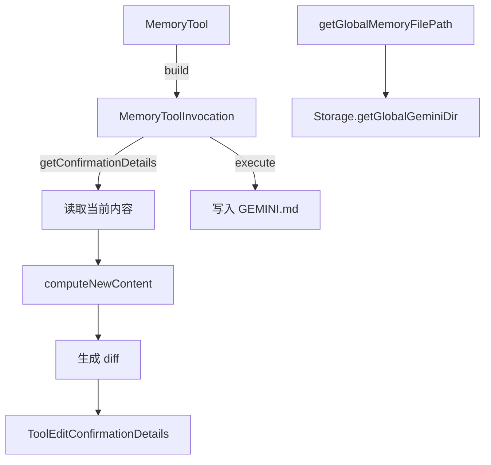

# memoryTool.ts

> 全局记忆保存工具，将用户偏好和事实持久化到跨工作区的 GEMINI.md 文件中。

## 概述
`MemoryTool` 实现了 "save_memory" 工具，允许 AI 将跨工作区的全局上下文（用户偏好、事实）追加到全局 `GEMINI.md` 文件的 `## Gemini Added Memories` 区段中。该工具实现了 `ModifiableDeclarativeTool` 接口，支持用户在确认前通过外部编辑器修改提议内容。写入前会进行 Markdown 注入防护（将换行折叠为单行），并生成 diff 供用户确认。

## 架构图

## 主要导出

### 常量
- `DEFAULT_CONTEXT_FILENAME = 'GEMINI.md'`
- `MEMORY_SECTION_HEADER = '## Gemini Added Memories'`

### 函数
- `setGeminiMdFilename(newFilename)` / `getCurrentGeminiMdFilename()` / `getAllGeminiMdFilenames()`: 配置文件名
- `getGlobalMemoryFilePath()`: 获取全局记忆文件完整路径

### 类
- `MemoryTool extends BaseDeclarativeTool implements ModifiableDeclarativeTool` - 记忆保存工具，Kind 为 Think
- `MemoryToolInvocation` (内部) - 执行器，含 allowlist 缓存和提议内容缓存

## 核心逻辑
1. **内容写入策略**：查找 `## Gemini Added Memories` 标题，存在则在其下追加条目，不存在则在文件末尾追加标题和条目
2. **Markdown 注入防护**：将 `fact` 中的换行替换为空格，去除前导 `-` 符号
3. **用户修改支持**：通过 `modified_by_user` 和 `modified_content` 参数支持用户编辑后的内容覆盖

## 内部依赖
- `./tools.ts`, `./tool-error.ts`, `./tool-names.ts`, `./modifiable-tool.ts`
- `./definitions/coreTools.ts`, `./definitions/resolver.ts`
- `../config/storage.ts` - 全局目录路径
- `diff` - 差异计算

## 外部依赖
- `node:fs/promises`, `node:path`
- `diff` - 文本差异生成
