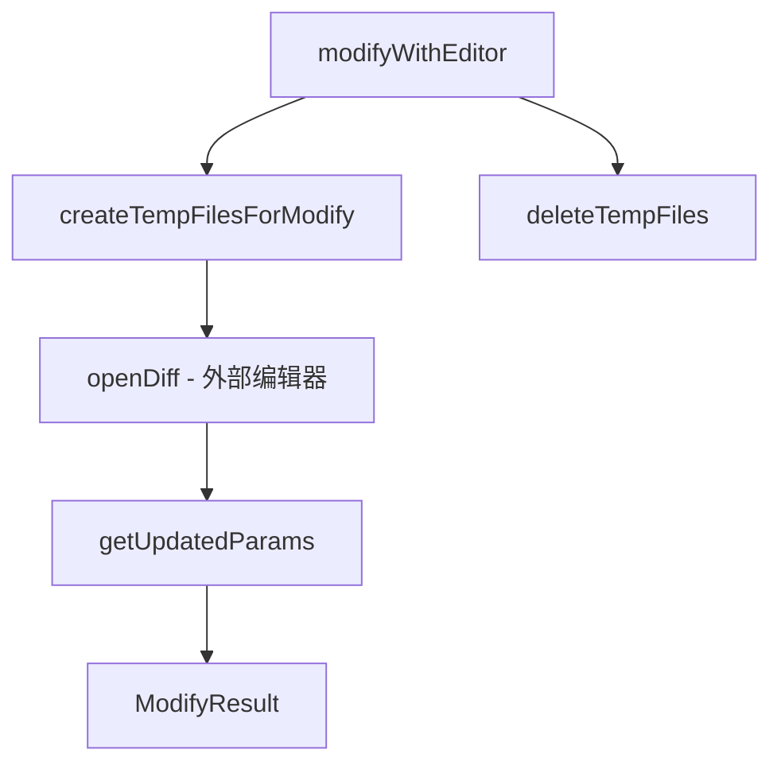

# modifiable-tool.ts

> 可修改工具接口与外部编辑器集成，支持用户在工具确认前通过 diff 编辑器修改提议内容。

## 概述
本文件定义了 `ModifiableDeclarativeTool` 接口和 `modifyWithEditor` 函数，为需要用户修改确认的工具（如 WriteFile、Memory）提供统一的"通过外部编辑器修改"流程。流程为：创建临时文件（当前内容 vs 提议内容）-> 打开外部 diff 编辑器 -> 读取用户修改后的内容 -> 计算新的 diff 和参数 -> 清理临时文件。

## 架构图

## 主要导出

### 接口
- `ModifiableDeclarativeTool<TParams>` - 可修改工具接口，提供 `getModifyContext()`
- `ModifyContext<ToolParams>` - 修改上下文，含 `getFilePath / getCurrentContent / getProposedContent / createUpdatedParams`
- `ModifyResult<ToolParams>` - 修改结果，含 `updatedParams` 和 `updatedDiff`
- `ModifyContentOverrides` - 内容覆盖选项

### 函数
- `isModifiableDeclarativeTool(tool)`: 类型守卫
- `modifyWithEditor(originalParams, modifyContext, editorType, abortSignal, overrides?)`: 核心编辑器集成函数

## 核心逻辑
1. 临时文件创建在 `os.tmpdir()` 下的随机目录中，权限设为 `0o700`（目录）和 `0o600`（文件）
2. 编辑器关闭后读取修改后的文件内容，通过 `createUpdatedParams` 生成新参数
3. 无论成功还是失败，`finally` 块中始终清理临时文件

## 内部依赖
- `./tools.ts` - `AnyDeclarativeTool`, `DeclarativeTool`, `ToolResult`
- `./diffOptions.ts` - `DEFAULT_DIFF_OPTIONS`
- `../utils/editor.ts` - `openDiff`, `EditorType`
- `../utils/errors.ts` - `isNodeError`

## 外部依赖
- `node:os`, `node:path`, `node:fs`
- `diff` - 文本差异生成
