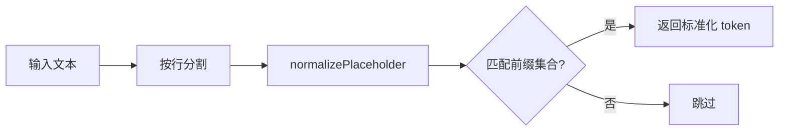

# omissionPlaceholderDetector.ts

> 检测代码中的省略占位符（如 "rest of methods ..."），防止 LLM 输出不完整内容。

## 概述
该文件提供了一个纯函数 `detectOmissionPlaceholders`，用于扫描文本中的省略类占位符模式。当 LLM 在 `write_file` 等工具调用中使用类似 `(rest of code ...)` 或 `// unchanged methods ...` 的简写时，该检测器会识别并报告，从而在参数验证阶段拒绝不完整的内容。

## 架构图

## 主要导出

### `detectOmissionPlaceholders(text: string): string[]`
- 扫描文本的每一行，检测省略占位符
- 返回所有匹配到的标准化占位符 token 数组
- 支持的前缀：`rest of` / `rest of method(s)` / `rest of code` / `unchanged code` / `unchanged method(s)`
- 支持 `// comment` 和 `(括号)` 两种包裹形式

## 核心逻辑
1. **行级扫描**：按 `\n` 分割文本，逐行处理
2. **标准化**：去除注释前缀 `//`、括号包裹 `()`，查找 `...` 省略号
3. **前缀匹配**：省略号前的文本必须属于预定义的 `OMITTED_PREFIXES` 集合
4. **后缀验证**：省略号后只能是连续的 `.` 或空字符

## 内部依赖
无

## 外部依赖
无
